<p align="center">
  <picture>
    <source media="(prefers-color-scheme: dark)" srcset="dashboard/static/assets/lockup-white.png">
    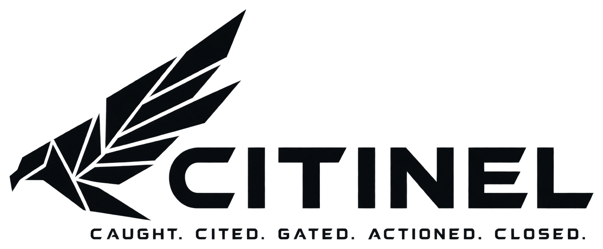
  </picture>
</p>

<h3 align="center">Caught. Cited. Gated. Actioned. Closed.</h3>

<p align="center">
An autonomous, glass-box Security Operations Centre for India's cooperative banks and small NBFCs.<br/>
Every verdict quotes the log line that proves it. Every action passes a readable rulebook and a named human. Every step lands on a ledger nobody can edit.
</p>

<p align="center">
  <a href="https://citinel-web.onrender.com"><b>Open the live console</b></a> ·
  <a href="#a-five-minute-tour">Five-minute tour</a> ·
  <a href="#the-seventeen-screens-and-what-each-one-proves">The seventeen screens</a> ·
  <a href="#partners-what-each-one-does-and-how-it-meets-its-tracks-criteria">Partners</a> ·
  <a href="#run-it-yourself">Run it yourself</a>
</p>

<p align="center">
  
  
  
  
  
  
</p>

> **Read this first, because everything else depends on it.** CITINEL *drafts* the regulator's report; a named human signs it and the bank files it. Response actions run against *simulated* endpoints, every one, and the console says so on screen. The false-positive rate is a *target*, not a measured result, and the Eval screen lists it as unmeasured. A product built to stop AI from overclaiming does not get to overclaim about itself.

**Contents.** [In one minute](#in-one-minute) · [The whole system on one page](#the-whole-system-on-one-page) · [A five-minute tour](#a-five-minute-tour) · [How CITINEL decides](#how-citinel-decides) · [Inside the investigation](#inside-the-investigation) · [Seven places it refuses to proceed](#seven-places-it-refuses-to-proceed) · [An incident's life](#an-incidents-life) · [The policy gate](#the-policy-gate-and-the-autonomy-dial) · [The ledger](#the-ledger-nobody-can-edit) · [The compliance clock](#the-compliance-clock) · [The seventeen screens](#the-seventeen-screens-and-what-each-one-proves) · [Where each of the forty lives](#where-each-of-the-forty-lives) · [Partners](#partners-what-each-one-does-and-how-it-meets-its-tracks-criteria) · [Where it runs](#where-it-runs) · [Design system](#design-system) · [Judging axes](#how-it-answers-the-judging-axes) · [Run it yourself](#run-it-yourself) · [What it does not claim](#what-citinel-does-not-claim) · [Repository map](#repository-map) · [Evidence trail](#the-evidence-trail) · [Team](#team)

---

## In one minute

**The problem.** India's cooperative banks and small NBFCs carry the same legal duties as a national bank: report a cyber incident to CERT-In within six hours, and comply with the DPDP Act. Almost none of them has a security operations centre. A human one costs upwards of a crore a year, against IT budgets of ₹25,000 to one lakh rupees a month. In July and August 2024 one ransomware attack on a shared technology vendor forced roughly 300 small cooperative and regional rural banks offline.

**The gap.** SIEM tools know what happened, but do not write the regulator's form. Compliance tools write forms, but do not know what happened. Rules-only detection is cheap and explainable, but blind to anything new. Raw AI copilots reason about the new, but hallucinate and can be steered by the very logs they read. Nothing affordable exists that a two-person IT team can run **and** that a regulator can trust, because nothing shows its work.

**CITINEL** is that security team, built as software. It runs every alert through two decisions in order. First, a deterministic one: *have we seen this exact pattern before?* Answered instantly by Sigma rules and a statistical scorer, closing most alerts before any AI model is called. Only the genuinely novel cases reach a swarm of Claude agents that investigate the way a human would, and are not allowed to say anything they cannot quote. Nothing they decide runs unsupervised if it matters. And when an incident is confirmed, the investigation itself drafts the CERT-In form.

**Why now.** The Government of India is connecting 63,000 primary agricultural credit societies to a single national platform under a ₹2,516 crore programme. The segment CITINEL is built for is being put online at national scale, right now, which means it is being exposed at national scale, right now. No competitor in a 2026 twelve-platform comparison of agentic SOC products mentions CERT-In, DPDP, RBI or SEBI at all.

---

## The whole system on one page

Read it left to right. The first two boxes and the last are plain code. The AI is fenced inside the third box and cannot reach past the two gates on its right. Every arrow is also a frame on the ledger at the bottom.


```mermaid
flowchart LR
  subgraph IN["1 · Logs arrive"]
    A[Bank's systems<br/>syslog · webhook · replayed corpus]
  end
  subgraph DET["2 · Deterministic layer · no AI"]
    B[Normalise to OCSF] --> C[Sigma rules<br/>+ anomaly scorer] --> D[Findings grouped<br/>into one incident]
  end
  subgraph AI["3 · Investigate · AI, but fenced"]
    E[Quarantine<br/>every log line is untrusted text] --> F[Five Claude agents<br/>Router · Enricher · Correlator · Narrator · Marshal]
    F --> G{Citation gate<br/>quote not in evidence?}
    G -- claim deleted --> F
    L[Seven Lyzr agents<br/>check from outside · advise only] -.-> F
  end
  subgraph ACT["4 · Decide and act"]
    H{Policy gate<br/>readable rulebook} -- reversible --> I[Runs with a<br/>rollback token]
    H -- consequential --> J[Waits for a<br/>named human]
    I --> K[Simulated endpoints only<br/>EVERY OUTLET IS BLANKED]
    J --> K
  end
  subgraph REG["5 · Comply"]
    M[CERT-In and DPDP drafts<br/>machine fills 8 of 10 fields] --> N[Human answers the<br/>legal question and signs] --> O[n8n notifies the CISO<br/>and opens a ticket]
  end
  A --> B
  D --> E
  G -- claims that survive --> H
  K --> M
  DET --> P[(Hash-chained ledger<br/>every step, append-only)]
  AI --> P
  ACT --> P
  REG --> P
```

**Three things to notice.** The AI never touches the bank's systems; it proposes, a rulebook decides, a human approves, and even then the endpoint is a simulator. A claim the AI cannot quote is deleted before anyone sees it. And every step you can see is also a frame on the ledger, hash-chained to the one before it, with an outside witness keeping its own count.

---

## A five-minute tour

Open <https://citinel-web.onrender.com>. Reading needs no login. The top bar and the left rail both navigate; hover a rail icon for its name. The first load after a quiet spell can take up to a minute while the service wakes.

1. **Overview.** The statutory countdown ring dominates. The footer names the corpus with its denominators: *5,311 findings on 3 records · OCSF 1.9.0 · sigma 3,302 @ r2026-07-01 · ATT&CK v16.1 · 29 techniques observed*.
2. **Queue.** Two lanes. The bin holds what Sigma rules caught with no model involved; the belt holds what the swarm is investigating.
3. **Replay** on `INC-0419`. The investigation as a film strip. Click any claim in the Narrator panel and the exact log line it quotes opens under it. The line under the panel heading says how many claims the citation gate deleted.
4. **Confidence.** Not a percentage alone: what supports the verdict beside what argues against it, and the discard tray of what was cut.
5. **Approvals.** The gate. Every proposed action shows its clause, its blast radius and its tier. Approving is a two-step control, and the receipt names the human.
6. **Compliance.** The CERT-In form filled from the record, eight fields automatic, two suggested, and one the machine refuses to answer because it is a legal question. **Report** prints it.
7. **Audit.** The ledger, every frame with its hash, and the witness beside it. Press **WALK THE CHAIN**.
8. **Eval.** What was measured, and, in the same table, what was not.

---

## How CITINEL decides

Every alert meets the same first question, and the answer decides whether an AI model is ever called.

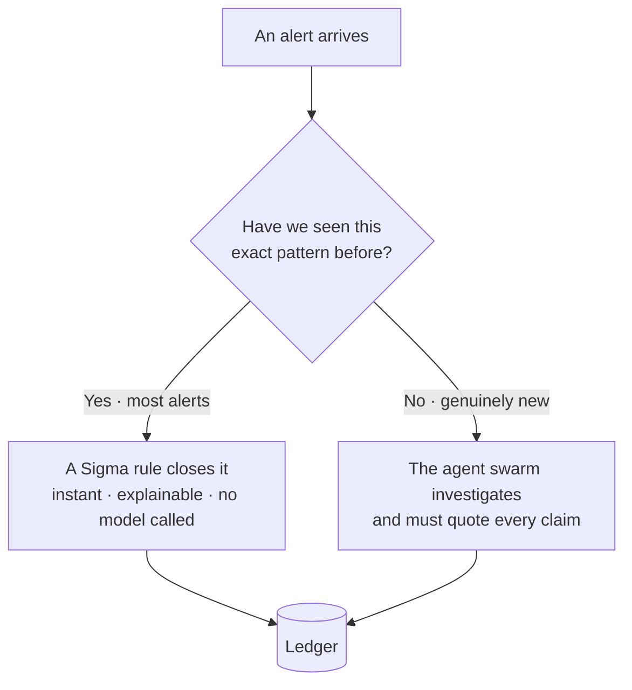
```mermaid
flowchart TB
  A[An alert arrives] --> Q{Have we seen this<br/>exact pattern before?}
  Q -- Yes · most alerts --> R[A Sigma rule closes it<br/>instant · explainable · no model called]
  Q -- No · genuinely new --> S[The agent swarm investigates<br/>and must quote every claim]
  R --> T[(Ledger)]
  S --> T
```

Known threats never depend on an AI model being available, correct, or even called (`U9`). The deterministic layer answers first and explains itself with the rule id and the exact log line. The swarm exists for the remainder, and its cost is paid only there. On the committed corpus that is 5,311 findings across 3 records, 29 distinct rules fired, and the swarm examined 40 findings per incident before the wide-lens sweep read the rest.

---

## Inside the investigation

Twelve AI agents across two vendors, and two roles that are deliberately plain code. Five Claude agents do the work in a fixed order. Seven Lyzr agents check that work from outside, and can advise but never gate.

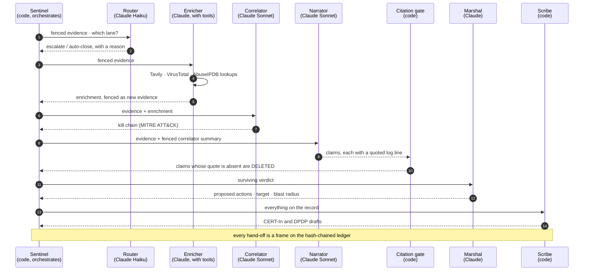
```mermaid
sequenceDiagram
  autonumber
  participant SN as Sentinel<br/>(code, orchestrates)
  participant RT as Router<br/>(Claude Haiku)
  participant EN as Enricher<br/>(Claude, with tools)
  participant CO as Correlator<br/>(Claude Sonnet)
  participant NA as Narrator<br/>(Claude Sonnet)
  participant CG as Citation gate<br/>(code)
  participant MA as Marshal<br/>(Claude)
  participant SC as Scribe<br/>(code)
  SN->>RT: fenced evidence · which lane?
  RT-->>SN: escalate / auto-close, with a reason
  SN->>EN: fenced evidence
  EN->>EN: Tavily · VirusTotal · AbuseIPDB lookups
  EN-->>SN: enrichment, fenced as new evidence
  SN->>CO: evidence + enrichment
  CO-->>SN: kill chain (MITRE ATT&CK)
  SN->>NA: evidence + fenced correlator summary
  NA-->>CG: claims, each with a quoted log line
  CG-->>SN: claims whose quote is absent are DELETED
  SN->>MA: surviving verdict
  MA-->>SN: proposed actions · target · blast radius
  SN->>SC: everything on the record
  SC-->>SN: CERT-In and DPDP drafts
  Note over SN,SC: every hand-off is a frame on the hash-chained ledger
```

| Role | Kind | Job in one line |
|---|---|---|
| Sentinel | code | Owns the case, calls each agent in order, writes every hand-off to the ledger. Never calls a model, because a model there would only reduce reliability. |
| Router | Claude Haiku | Decides the lane: escalate to the swarm, or auto-close with a stated reason. The cheap model, on purpose. |
| Enricher | Claude, with tools | The only multi-turn agent. Looks indicators up on Tavily, VirusTotal and AbuseIPDB; its findings come back fenced as new evidence. |
| Correlator | Claude Sonnet | Joins scattered findings into one attack story and maps each step to MITRE ATT&CK. Its summary is fenced before the Narrator reads it. |
| Narrator | Claude Sonnet | Writes the verdict as claims, each carrying a quoted log line, a confidence, and what argues against it. |
| Citation gate | code | Deletes any claim whose quote is not literally in the evidence. Not flagged. Not downranked. Deleted. |
| Marshal | Claude | Proposes response actions with a target, an action class and a blast radius. Proposes only. |
| Scribe | code | Assembles the CERT-In and DPDP drafts from the record. Never calls a model. |

No swarm agent talks to another directly. The output of one becomes fenced input to the next, so one agent cannot pass hidden instructions to the next (`KD4`). Any agent can fail without stopping the chain, and a failed stage records as degraded rather than hidden.

The seven Lyzr agents sit beside the chain: an independent triage lane, a review of the drafted fields, the shift-handover note, an audit of every citation, a proportionality opinion on each action, a corpus-coverage advisory, and the ledger witness. All seven report configured on the live deployment. On 4 September the citation auditor rated five of eight claims *more* strictly than the pipeline had, which is exactly what an independent checker is for. A checker inside the same system, with the same model and the same blind spots, would prove nothing.

**What the research says, and why the design follows it.**

- Naive majority voting among AI agents is empirically unstable and prone to *confabulation consensus*, agents agreeing on the same wrong answer (`U24`). So CITINEL never counts votes. It demands quotes.
- Agent self-verification carries documented risks of self-deception, and self-consistency fails exactly when a model is confidently wrong (`U27`). That is the argument for a code-only citation gate, a policy gate and a human sign-off rather than a model checking itself.
- Durable improvement in agentic systems comes from scaffolding changes, not retraining (`U25`). Corrections therefore live in the corpus and the rulebook, where they are fast to make and easy to reverse.
- The foundation model was chosen for the strongest resistance to log-based prompt injection in independent 2026 benchmarking, a 0.0 percent verbatim-hijack rate against a worst case of 86.2 percent (`U2`). One non-peer-reviewed preprint, thirty trials per model: illustrative, not certified.
- If multi-agent verdict aggregation is ever added, a published low-latency consensus protocol exists as the reference design, reaching 1.2 to 20 times lower latency within 2.5 percent accuracy (`U30`). It is not used today, because today the gate is a quote, not a vote.

---

## Seven places it refuses to proceed

Every one of these fails closed. A judge can trigger most of them from the console.

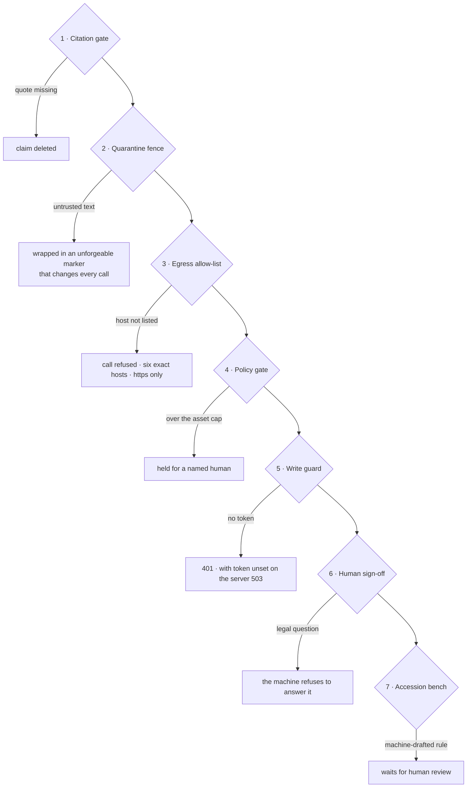
```mermaid
flowchart TB
  G1{1 · Citation gate} -- quote missing --> X1[claim deleted]
  G2{2 · Quarantine fence} -- untrusted text --> X2[wrapped in an unforgeable marker<br/>that changes every call]
  G3{3 · Egress allow-list} -- host not listed --> X3[call refused · six exact hosts · https only]
  G4{4 · Policy gate} -- over the asset cap --> X4[held for a named human]
  G5{5 · Write guard} -- no token --> X5[401 · with token unset on the server 503]
  G6{6 · Human sign-off} -- legal question --> X6[the machine refuses to answer it]
  G7{7 · Accession bench} -- machine-drafted rule --> X7[waits for human review]
  G1 --> G2 --> G3 --> G4 --> G5 --> G6 --> G7
```

Roughly two-thirds of attacks on AI agents are inherited or amplified from the base model once it gets tools and autonomy (`U28`), and no single defence is robust across every axis (`U29`). That is why there are seven of these and not one: quarantine, a detector, an allow-list and a human gate, layered. The line that makes this real: four of the eighteen bugs found in the 4 September live audit were violations of the first four gates. The rules are load-bearing, and they needed testing rather than trust.

---

## An incident's life

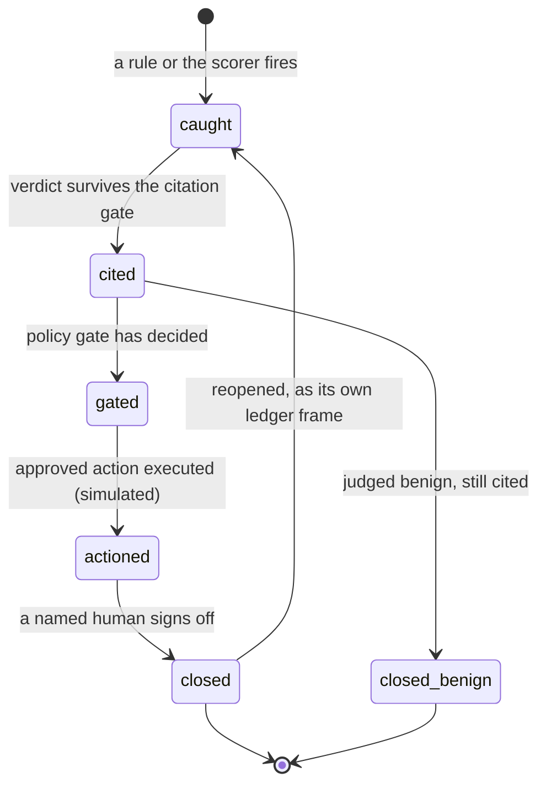
```mermaid
stateDiagram-v2
  [*] --> caught: a rule or the scorer fires
  caught --> cited: verdict survives the citation gate
  cited --> gated: policy gate has decided
  gated --> actioned: approved action executed (simulated)
  actioned --> closed: a named human signs off
  cited --> closed_benign: judged benign, still cited
  closed --> caught: reopened, as its own ledger frame
  closed --> [*]
  closed_benign --> [*]
```

The five states are the product's signature: the arc that becomes a ring on the Overview, the Replay dial, the Audit log, the Executive board and the Handover card. A record can only move forward. Reopening is not an edit; it is a new frame that says who reopened it and why. The state names are also literal labels in the interface, not tagline copy.

---

## The policy gate and the autonomy dial

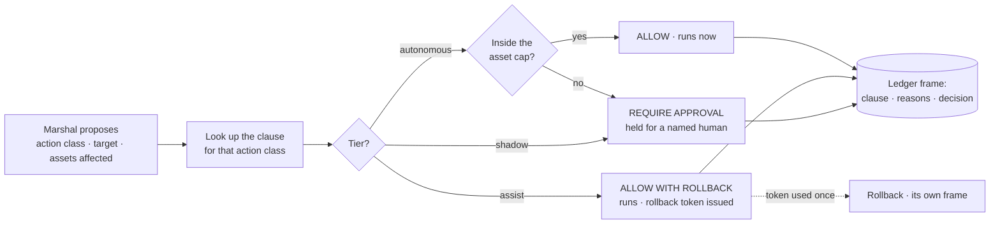
```mermaid
flowchart LR
  P[Marshal proposes<br/>action class · target · assets affected] --> C[Look up the clause<br/>for that action class]
  C --> T{Tier?}
  T -- autonomous --> CAP{Inside the<br/>asset cap?}
  CAP -- yes --> A1[ALLOW · runs now]
  CAP -- no --> A3[REQUIRE APPROVAL<br/>held for a named human]
  T -- assist --> A2[ALLOW WITH ROLLBACK<br/>runs · rollback token issued]
  T -- shadow --> A3
  A1 --> L[(Ledger frame:<br/>clause · reasons · decision)]
  A2 --> L
  A3 --> L
  A2 -. token used once .-> RB[Rollback · its own frame]
```

The rulebook is a file a bank's IT head can read and change (`U3`). Autonomy is set per action class, not per deployment (`U18`): looking up an indicator can run alone; isolating a host runs with a rollback token; disabling an account waits for a named person. On the live deployment the dial reads *shadow by default · 3 autonomous · 4 assist · 1 shadow*, and every gate decision cites the rulebook's version and fingerprint on the ledger. Blast-radius rings were designed in from day one, explicitly modelled on the CrowdStrike July 2024 lesson, when one unbounded push reached 8.5 million devices (`U19`). The declared blast radius can never be talked down by the requester; the clause cap is the safeguard.

Two honest notes. Per-action policy gates with audit trails are table stakes among established vendors, so CITINEL does not lead with the gate; it leads with what the gate protects and what the ledger proves. And autonomous-vehicle research validates a user-adjustable trust dial while warning that raising it measurably increases risk (`U21`). The dial was built knowing that, which is why raising a tier never lowers a safeguard.

---

## The ledger nobody can edit

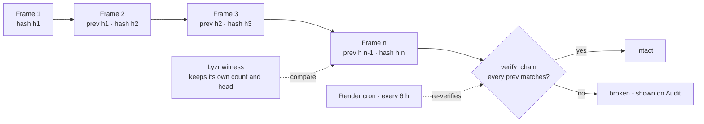
```mermaid
flowchart LR
  F1[Frame 1<br/>hash h1] --> F2[Frame 2<br/>prev h1 · hash h2] --> F3[Frame 3<br/>prev h2 · hash h3] --> FN[Frame n<br/>prev h n-1 · hash h n]
  FN --> V{verify_chain<br/>every prev matches?}
  V -- yes --> OK[intact]
  V -- no --> BAD[broken · shown on Audit]
  W[Lyzr witness<br/>keeps its own count and head] -. compare .-> FN
  CRON[Render cron · every 6 h] -.re-verifies.-> V
```

Every frame carries the hash of the one before it, so an edit anywhere breaks everything after. The chain check alone cannot see one attack: replacing the whole file with a rewritten one that verifies against itself. That is what the Lyzr witness is for (`KD3`). It keeps its own count and head, and the Audit screen shows the comparison. A witness that has merely seen fewer entries reports *lagging*, not *tampered*; a witness that disagrees at equal or greater length raises the alarm. At the time of writing the live chain holds 5,817 entries and verifies intact.

The ledger records what the system did, never what a model thought. A model's account of itself is a summary, not evidence, so the audit record is structurally separate from the AI's reasoning output (`U5`), a distinction most competitors never need to draw because they never expose reasoning.

---

## The compliance clock

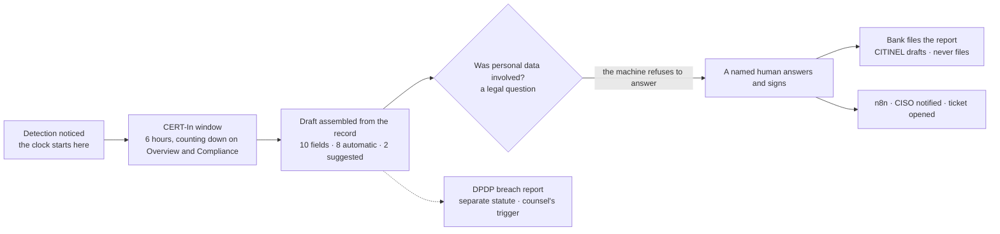
```mermaid
flowchart LR
  T0[Detection noticed<br/>the clock starts here] --> W[CERT-In window<br/>6 hours, counting down on Overview and Compliance]
  W --> D[Draft assembled from the record<br/>10 fields · 8 automatic · 2 suggested]
  D --> Q{Was personal data involved?<br/>a legal question}
  Q -- the machine refuses to answer --> H[A named human answers and signs]
  H --> F[Bank files the report<br/>CITINEL drafts · never files]
  H --> N[n8n · CISO notified · ticket opened]
  D -.-> DP[DPDP breach report<br/>separate statute · counsel's trigger]
```

The window is measured from the moment CITINEL opened the record, and the clock never restarts. The draft is assembled from the ledger, not from anyone's memory. One field is refused by the machine on purpose: whether personal data was involved is a legal determination, so a named human answers it and signs. Then, and only then, n8n notifies the CISO and opens a ticket.

This is the strongest defensible ground the product has. No named competitor in a 2026 twelve-platform comparison of agentic SOC products mentions CERT-In, DPDP, RBI or SEBI at all (`U6`, one comparison's omission rather than an exhaustive audit). The closest public claim to auto-draft the DPDP breach artefact failed adversarial verification nought to three (`U7`). The clock was built ahead of DPDP's breach-notification duty coming into force, the Rules having been notified on 13 November 2025 with Rule 7 activating about eighteen months later, rather than in reaction to enforcement (`U8`). And a poisoned log string that survives investigation still cannot launder itself into the draft a human signs: it renders escaped and visibly flagged (`U20`).

---

## The seventeen screens, and what each one proves

Sixteen operational screens plus the scripted Demo make seventeen; the knowledge base numbers the sixteen and lists the Demo beside them, and this file walks all seventeen. Every screenshot below was captured from the live deployment on 10 September 2026 with [docs/readme/capture.mjs](docs/readme/capture.mjs), on the demo incident `INC-0419` where a screen needs one. Nothing is mocked up. Where a screen shows a closed CERT-In window, that is because the demo records are a corpus replay whose six-hour windows closed long before this session; the screen says so itself.

Each screen borrows its composition from a real physical instrument, on purpose: seventeen cockpit-styled dashboards would be a second cliché. Under each screen you will find what it is for, what to look at, **what it proves** (the catalogued differentiators, coded `KD` for the ten a judge can check in the code in under a minute, `U` for the thirty researched claims, `H` for the four headline features they compose into) and **what it does not claim**. A product built to stop AI from overclaiming has to hold that last line about itself, so it is on every screen. Items marked *said here, not shown here* are researched claims that belong to this screen's subject but are evidenced by the research corpus rather than by pixels.

The forty items are indexed at the [end of this section](#where-each-of-the-forty-lives).

### See the situation

#### 1. Overview

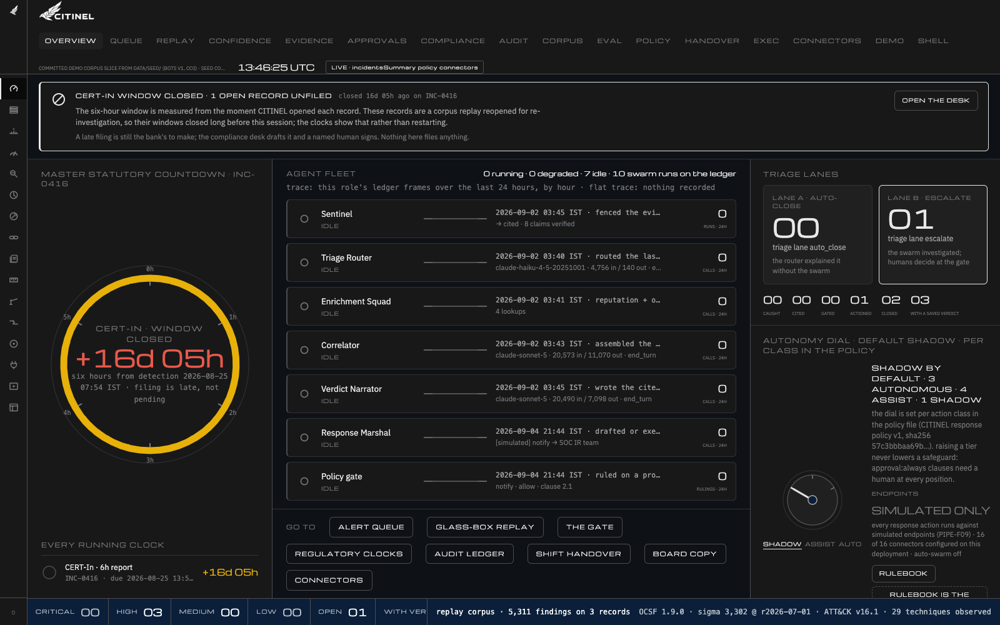

**What it is for.** The first screen. It shows every open incident the system is handling, each with its own CERT-In clock (CERT-In is India's national cyber incident agency, and it requires a report within six hours of detection). You also see the health of the agent fleet, the two triage lanes, and the counts of records in each of the five states: caught, cited, gated, actioned and closed.

**Borrowed instrument.** A master statutory countdown: one large dial at the head of the screen for the most urgent open record, labelled **CERT-IN · REMAINING** and counting down *of 06:00:00 from detection*. When the window passes it reads **CERT-IN · WINDOW CLOSED** and *filing is late, not pending*. The filing itself is the bank's to make; CITINEL only drafts.

**What to look at.**
- **EVERY RUNNING CLOCK**, one line per open record, each with its due time.
- **AGENT FLEET**: one row per role, with its last ledger frame, which model it used and how many tokens it spent.
- **TRIAGE LANES**: how many records the router auto-closed with an explanation and how many the swarm investigated.
- **AUTONOMY DIAL**, reading *shadow by default · 3 autonomous · 4 assist · 1 shadow*, with the policy version and fingerprint beside it.
- The footer line, which names the corpus with its denominators: *5,311 findings on 3 records · OCSF 1.9.0 · sigma 3,302 @ r2026-07-01 · ATT&CK v16.1 · 29 techniques observed*.
- The **LIVE** chip in the header, which lists the three sources this page read live. It reads **DEMO DATA** when it could not.

**What this screen proves.**
- `KD10` **No measurement without its denominator.** No number is shown without the total it was counted out of. A rate without the population it was measured on is a marketing figure, and CITINEL does not render one. A judge can check this on the screen itself: every count on the footer and in the lanes carries its base.

**What it does not claim.**
- The false-positive rate, the share of alerts that turn out to be harmless, is unmeasured. The target is under 10 percent; that is a target, not a result.
- The demo data is a generic set of security incidents (Splunk BOTS v1), not banking-specific attacks. No bank has yet shared its own system data, so impact on real cooperative banks is unvalidated.
- Every response action runs against a simulated endpoint. No real bank system is touched.

#### 2. Queue

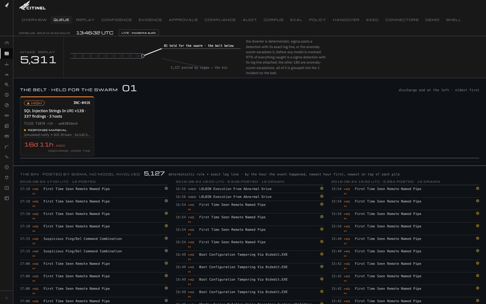

**What it is for.** Where new detections arrive. It has two lanes. **The bin** holds what Sigma rules (a standard format for describing known attack patterns) caught on their own, each posted with the exact log line that proves the match, with no AI model involved. **The belt** holds the open incidents that rules alone could not explain. Those are held for the AI agents to investigate and, where an action is proposed, for a named human at the policy gate.

**What to look at.**
- **THE BIN · POSTED BY SIGMA, NO MODEL INVOLVED**, the heading that states the deterministic floor in its own words.
- **THE BELT · HELD FOR THE SWARM**, with the *discharge end at the left · oldest first*, so the record that has waited longest is nearest the operator.
- Each belt card names who holds it now: the correlator, the enricher, the narrator, or *AT THE GATE*.

**What this screen proves.**
- `U9` **Known threats never depend on an AI model.** Sigma rules catch known attacks in plain code before any model is called. If every AI model were unavailable, known threats would still be caught, and each catch explains itself with the rule id and the log line.
- `H1` **Glass-box cited triage pipeline.** This is the first of three screens (Queue, Replay, Demo) that together show the headline feature: deterministic detection first, then cited investigation of the remainder.

**What it does not claim.**
- The false-positive rate is unmeasured for the rules and for the anomaly scorer alike.
- The bin lists only Sigma detections. Anomaly-scorer escalations, unusual behaviour flagged statistically with no named rule to cite, are counted in the intake total and grouped into the belt's incidents, but they are not listed in the bin.
- If the service cannot be reached, the screen falls back to authored demo data and the header badge says **DEMO DATA**. A scripted card is never drawn beside a real one.

#### 3. Shell

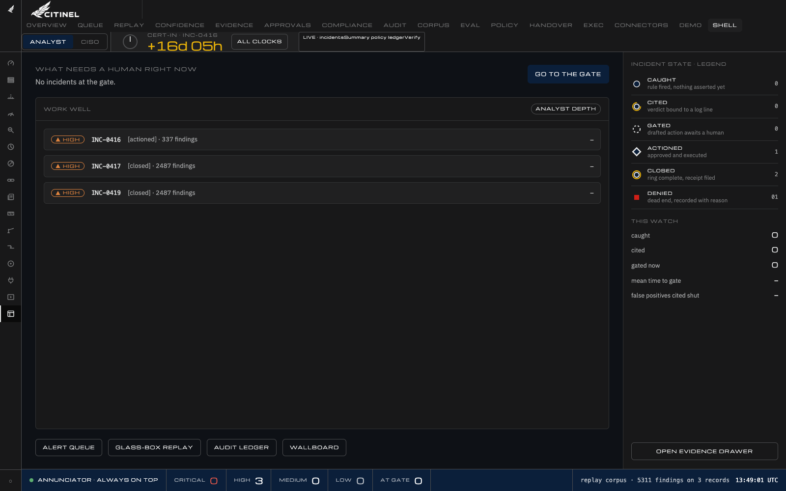

**What it is for.** The frame every operator sees. Across the top sits the CERT-In clock, which names the incident it is measuring (for example **CERT-IN · INC-0417**), counts down six hours from the moment that record was opened, and switches to a plus figure once the window is missed. Two header buttons, **ANALYST** and **CISO**, switch the same frame between the analyst's working depth and the shallower summary depth for the chief information security officer. The main panel, **WORK WELL**, lists the records that need a person right now. A side panel, **INCIDENT STATE · LEGEND**, shows the states with live counts. A strip along the bottom, **ANNUNCIATOR · ALWAYS ON TOP**, shows critical, high, medium, low and at-gate counts and stays visible under every drawer and pop-up.

**What to look at.**
- **WORK WELL**: up to five records in the analyst view, three in the CISO view, each with severity, id, state and finding count.
- **INCIDENT STATE · LEGEND**: six rows, CAUGHT, CITED, GATED, ACTIONED, CLOSED and DENIED.
- **ANNUNCIATOR · ALWAYS ON TOP**, the one thing that never scrolls away.
- **OPEN EVIDENCE DRAWER**, which shows that drawers stop above the strip.
- **DEMO MODE · SHOWING AUTHORED FALLBACK DATA**, the banner that appears only when the service is not reached.

**What this screen proves.** The knowledge base assigns no catalogued differentiator to the Shell. It is the frame that carries the other screens' work and claims none of its own. What it does show is the design system's discipline: one token set, one severity ramp where every level has a colour, a shape and a printed label, and a state legend that uses the product's five state words literally.

**What it does not claim.**
- No investigation happens here and no response action executes from here. The log lines and verdicts behind each row live on Replay, Evidence and Confidence.
- The DENIED row in the legend shows a fixed 01 that is not read from the service, and the evidence drawer shows one fixed sample line for INC-0417 to demonstrate layout, not the live record.
- Several side-panel figures, including mean time to gate and false positives cited shut, display a dash because they are unmeasured.

### Understand one incident

#### 4. Replay

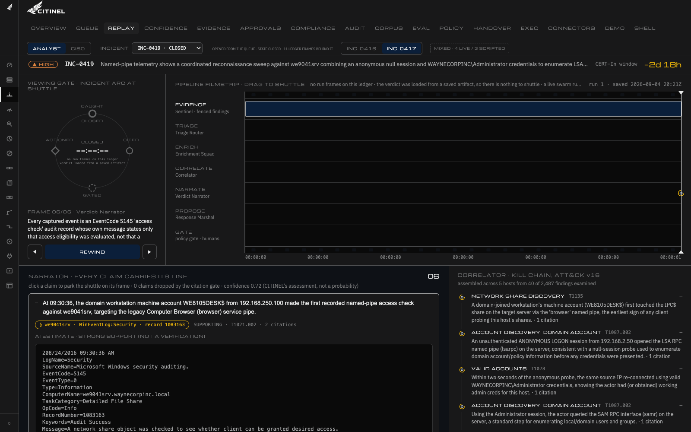

**What it is for.** The key screen. It plays back one investigation frame by frame, like scrubbing through a video, rebuilt from the audit ledger. Every claim on the screen names the exact log line that proves it, so you can check the evidence by reading the quoted text yourself. The right-hand column holds the two Gemini panels: the wide-lens sweep over the findings the investigation did not examine, and the reading of any screenshot an analyst forwarded.

**What to look at.**
- The header line beginning *opened from the queue*, which names the record's current state and how many ledger frames sit behind it, and the incident ring, whose centre reads that state.
- **NARRATOR · EVERY CLAIM CARRIES ITS LINE**, and under it the subheading *0 claims dropped by the citation gate* (the count is live; on other runs it is not zero).
- The citation chip under each claim. For a log-based claim it shows host, log source and record number, for example `upi-switch/2026-08-23.log:41113`. Select a claim and **OPEN IN EVIDENCE VIEWER** appears.
- **WIDE-LENS SWEEP · GEMINI**, with the scale *40 examined by the investigation · 2,487 on the record · 2,447 read only by the sweep*.
- **WHAT THE MODEL SAW · OBSERVATION, CARRIES NOTHING**, the label on the **ANALYST IMAGE · GEMINI VISION** panel.
- The **SIMULATED ENDPOINTS** chip beside **RESPONSE MARSHAL PROPOSES**.

**What this screen proves.**
- `KD1` **A claim that cannot quote its evidence is deleted.** Not flagged, not downranked. The gate is code, and the count of what it cut is printed at the top of the Narrator panel.
- `U1` **Every verdict cites the exact log line it rests on.** Explainability is a structural requirement of the verdict format, not a presentation choice.
- `KD4` **One agent cannot smuggle instructions to the next.** The Correlator's attack story is wrapped as untrusted data before the Narrator reads it, so agent-to-agent laundering is closed.
- `KD2` **Observation is not fact, enforced in the data.** What Gemini says is marked `not_evidence` inside the record itself, and no verdict, lane or gate decision can rest on it. The panel heading says the same in plain words: *observation, carries nothing*.
- `KD6` **Blind spots are declared, then closed.** The investigation examined 40 of 2,487 findings. The screen says so first, then the sweep reads the 2,447 it did not examine. The disclosure comes before the remedy.
- `H1` **Glass-box cited triage pipeline**, the headline feature, is most visible here.

*Said here, not shown here.* The model behind the swarm was chosen for the strongest resistance to log-based prompt injection in independent 2026 benchmarking (`U2`, one preprint, illustrative rather than certified). Vote counting among agents is avoided because majority voting is unstable under shared bias (`U24`); model self-verification is avoided because it fails exactly when a model is confidently wrong (`U27`); and a low-latency consensus protocol is on file as the reference should aggregation ever be added (`U30`).

**What it does not claim.**
- The demo replays generic Splunk BOTS data, not banking telemetry.
- The evaluation harness measures the deterministic layers only, so the sweep's accuracy is not a measured figure, and 2,447 of the 2,487 findings were read only by the sweep, whose output cannot support a verdict.
- Response actions run against simulated endpoints only; the chip says so.
- The false-positive rate is not measured. Industry runs 46 to 80 percent by survey; the target is under 10 percent.

#### 5. Confidence

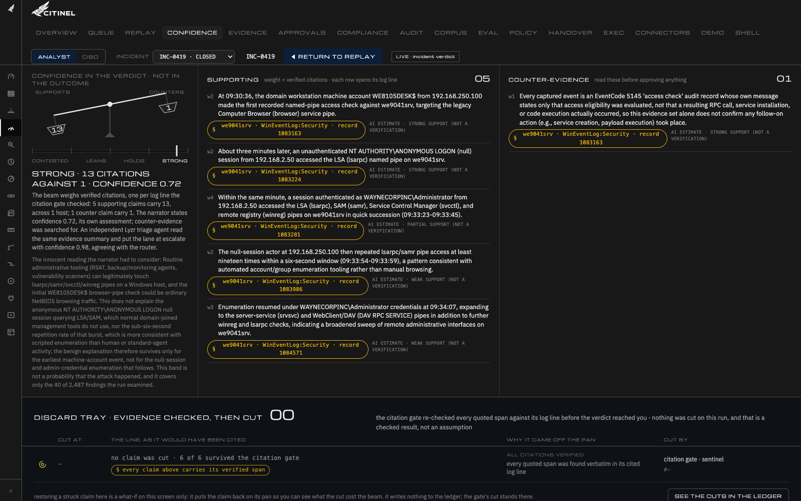

**What it is for.** How strongly CITINEL holds its own verdict on one incident, and what argues the other way, in the same view. The verdict is laid out as two columns, **SUPPORTING** on the left and **COUNTER-EVIDENCE** on the right, each line pinned to the exact log line that carries it. If no counter-evidence was found, the right column is declared empty on screen rather than hidden. Below the columns sits the **DISCARD TRAY**: the claims the AI narrator wrote that failed the citation gate, each shown struck through with the line as it would have been cited, the reason it was cut, who cut it and when.

**Borrowed instrument.** A beam balance: a pivot, a beam that rotates with the weight of verified citations, and two pans labelled **SUPPORTS** and **COUNTERS**. Beneath it a band slider with a rider that moves with the beam, and a caveat line stating that the band is not a probability that fraud occurred.

**What to look at.**
- **CONFIDENCE IN THE VERDICT · NOT IN THE OUTCOME**, the heading that draws the distinction.
- The **SUPPORTS** and **COUNTERS** counts, or **NONE FOUND · COLUMN LEFT OPEN** when the column is empty.
- **DISCARD TRAY · EVIDENCE CHECKED, THEN CUT**, with **THE LINE, AS IT WOULD HAVE BEEN CITED**, **WHY IT CAME OFF THE PAN**, **CUT BY** and **CUT AT** for each cut claim.
- **SEE THE CUTS IN THE LEDGER**, which links to the audit frames.
- When the Lyzr second-opinion agent has run, the band statement reports whether that independent agent agreed with CITINEL's routing.

**What this screen proves.**
- `U4` **Confidence is never shown on its own.** The evidence that argues against the verdict is displayed next to it, and when there is none the empty column is declared rather than left out. The page calls it confidence, never certainty. A confident-looking number cannot mislead when its opposition is printed beside it.
- `U22` **Calibrated self-assessment is what earns trust.** Published research, adversarially re-checked for this project, found that showing calibrated confidence rather than a raw score raised human trust by 34 to 52 percent at identical accuracy, cutting both under-reliance and over-reliance. That is a finding about how confidence should be shown; it is not a claim that CITINEL's own score has been calibrated.

**What it does not claim.**
- The band is CITINEL's own reading of the evidence it kept for one incident. It is not a measured error rate, not a probability that fraud occurred, and not a recommendation.
- Whether counter-evidence was searched for depends on the run, and the screen says which. Without the search flag the page itself calls an empty column *an unasked question, not a clean bill of health*.
- **WHAT IF · RESTORE** puts a cut claim back on its pan so you can see what the cut cost the balance. It writes nothing to the ledger; the gate's cut stands.

#### 6. Evidence

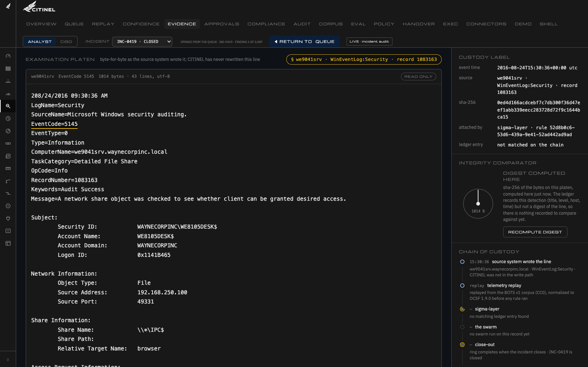

**What it is for.** The raw log line behind one detection, drawn byte for byte as the source system wrote it. The panel says CITINEL has never rewritten this line. Beside it is the chain of custody, a list of who handled the line and when, and a dial that computes a fingerprint of the bytes (a SHA-256 digest) in the browser. If an exhibit contains text an attacker could have written, that text is shown inside a marked box that records where it came from, kept apart from what the verdict claims, so an operator can read it without it ever being treated as an instruction.

**What to look at.**
- **CHAIN OF CUSTODY**.
- **INTEGRITY COMPARATOR**, the fingerprint dial.
- **ATTACKER-CONTROLLED FIELD · QUARANTINED**, the four-signal quarantine well: monospace, inset, dashed grey border, persistent corner label.
- **WOULD THIS STAND UP**, the checklist shown in the CISO view.
- **FIND THIS ENTRY IN THE LEDGER**.

**What this screen proves.**
- `U20` **Hostile text is shown, never cleaned.** Attacker-written text that reached CITINEL is displayed exactly as received, inside a marked box with its source and time, because a tidied copy would be a false record. The verdict rests on the structured fields, not on the hostile text.
- `H3` **Injection-hardened quarantine plane.** This is one of four screens (Demo, Evidence, Compliance, Connectors) where the headline feature is visible: every log line is untrusted by default, and the interface never lets it pretend otherwise.

*Said here, not shown here.* Roughly two-thirds of attacks against tool-using AI agents are inherited from the base model, because alignment does not transfer once a model gets tools and memory (`U28`); that is the research case for treating every log line as hostile. The architectural name for the boundary that keeps the core isolated from every external system is the Anti-Corruption Layer (`U26`).

**What it does not claim.**
- The integrity dial computes a fingerprint now, in the browser. On live findings nothing upstream recorded a digest to compare against, and the page's own note says a digest computed now proves nothing about the past. The reading **HASH MATCHES** appears only on the authored example exhibits, as does the quarantine box; live findings are drawn without it.
- When the service cannot be read, the page falls back to authored exhibits headed **EXHIBITS CITED BY INC-0417**. Live and authored content are never mixed.
- No verdict claim is stored against a finding, and no export is built; the record is served whole from the web service instead.

### Decide and act

#### 7. Policy

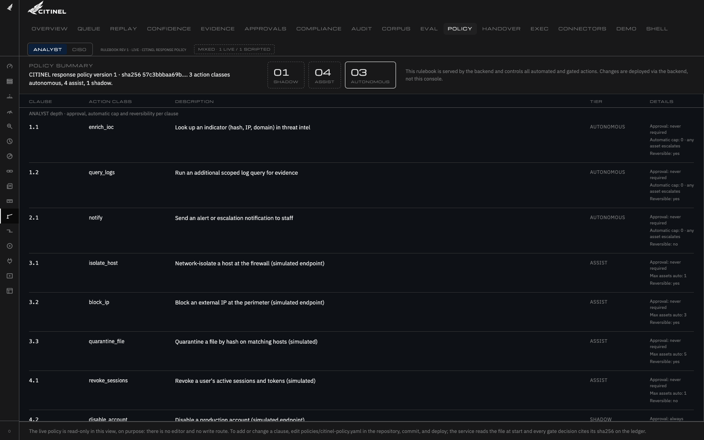

**What it is for.** The rulebook that decides which response actions the system may run on its own and which must wait for a named human. Each action class, one kind of response such as blocking an IP address or disabling an account, has its own tier. The gate applies these rules on every proposed action.

**What to look at.**
- **POLICY SUMMARY**: the policy version, the first twelve characters of the policy file's SHA-256 fingerprint, and how many action classes sit in each tier.
- The columns **CLAUSE**, **ACTION CLASS**, **DESCRIPTION**, **TIER**, then **DETAILS** in the analyst view or **WHO DECIDES** in the CISO view.
- The three tiers in words: **SHADOW** (the system proposes and logs only; a named human decides every time), **ASSIST** (runs on its own up to a set number of assets, with a rollback token; beyond that cap a human decides) and **AUTONOMOUS** (runs without approval).
- The footer note that the live policy is read-only here, on purpose, and that a change means editing `policies/citinel-policy.yaml`, committing and deploying.

**What this screen proves.**
- `H2` **A readable per-class autonomy dial.** The autonomy setting is a dial the bank reads in plain words, set separately for each kind of action. This screen is where the dial is read; Approvals is where it is applied.
- `U3` **The rulebook is a document, not a score.** The authorisation policy is a readable file kept in the repository, mirrored clause for clause in an OPA Rego file, rather than a confidence threshold hidden inside a model. A bank's IT function reads it and changes it by editing the file.
- `U18` **Autonomy per action class, not per deployment.** Reversible actions can run unattended while consequential actions wait for approval, all in one policy file, without reconfiguring the whole system.

*Said here, not shown here.* Autonomous-vehicle research validates the adjustable-autonomy pattern and simultaneously measures increased risk at higher settings (`U21`). The warning is used alongside the validation: raising a tier here never lowers a safeguard.

**What it does not claim.**
- There is no editor and no write route. Only the deployed policy is shown, with no draft, no history and no diff.
- The fingerprint is a hash, not a signature. Proof that a given action was gated by this version lives on the Audit screen, where every gate decision cites it.
- Every action this rulebook allows still runs against simulated endpoints only. The policy file's own header says so.
- Per-action policy gates with audit trails are offered by several established vendors. What is distinctive here is that the rulebook is readable and that every decision cites its fingerprint on the ledger.

#### 8. Approvals

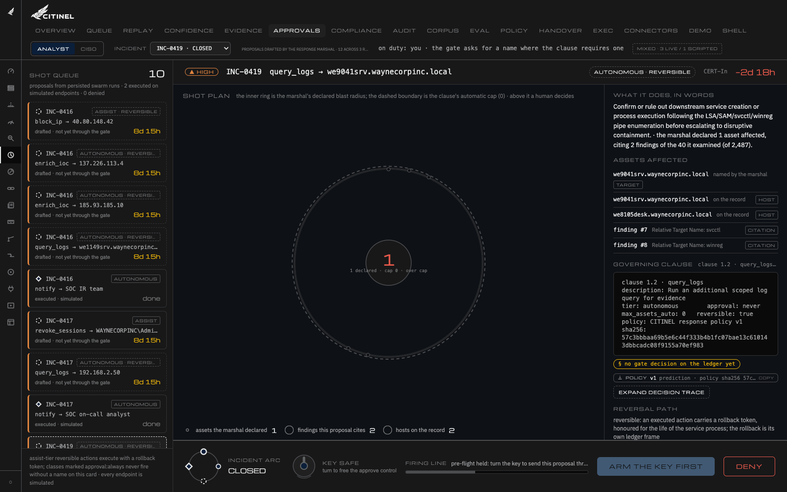

**What it is for.** The gate itself. Each proposed response action is checked against a named policy clause that carries an asset cap, the most assets that type of action may touch on its own. Consequential actions wait for a named human to approve them before anything runs. Reversible actions receive a rollback token, a code that lets a human undo the change.

**Borrowed instrument.** The **SHOT PLAN** ring diagram, the section the page marks as its primary instrument: the inner ring is the declared blast radius, how many assets the action touches; the dashed outer ring is the clause cap.

**What to look at.**
- **SHOT PLAN**, and beside it **WILL DO** and **WILL NOT DO**, what the action deliberately will not touch, printed before anyone commits.
- **GOVERNING CLAUSE**, the clause that ruled on the proposal, printed as a clause and not a score, and **PRECEDENT AND AUTHORITY**, this action type's history on the ledger.
- **EXPAND DECISION TRACE**, which opens the gate's ruling line by line.
- **ROLLBACK TOKEN** next to **ROLL BACK NOW**.
- **APPROVE AND FIRE**, which reads **ARM THE KEY FIRST** until the key control is turned from **KEY SAFE** to **KEY ARMED**, so arming and approving are two separate steps. The receipt names the human who approved.

**What this screen proves.**
- `KD8` **A policy gate with rollback tokens and blast-radius caps, trace expandable.** The clause that ruled is printed, not a score; the trace shows the ruling line by line; reversible actions carry a token that undoes them. The rulebook is readable policy code: a YAML rulebook the in-process gate evaluates today, mirrored in an OPA Rego file that is written but not yet the active engine.
- `U19` **Blast-radius rings from day one.** The limits on how many assets one action may touch were designed in at the start, modelled on the CrowdStrike July 2024 incident that reached 8.5 million devices, not bolted on after a failure.
- `U18` **Per-action-class autonomy**, applied: reversible actions run on their own while consequential actions stay gated, within one configuration.
- `H2` **The readable autonomy dial**, in use.

**What it does not claim.**
- Response actions execute against simulated endpoints only; the screen labels the run **SIMULATED ENDPOINT**. No real bank system is ever touched.
- After approval the screen shows a receipt and **FIND IT IN THE LEDGER**. In the page's own words, the mock returns success unconditionally, so this proves the right call was made with the right arguments and nothing more.
- On the live deployment the rollback token has no expiry and is held only in the running service; a restart forgets it. The 24-hour expiry shown on the authored demo cards is narrative, not a live figure.
- The declared blast radius can never be talked down by the requester; the clause cap is the safeguard.

### Comply and file

#### 9. Compliance

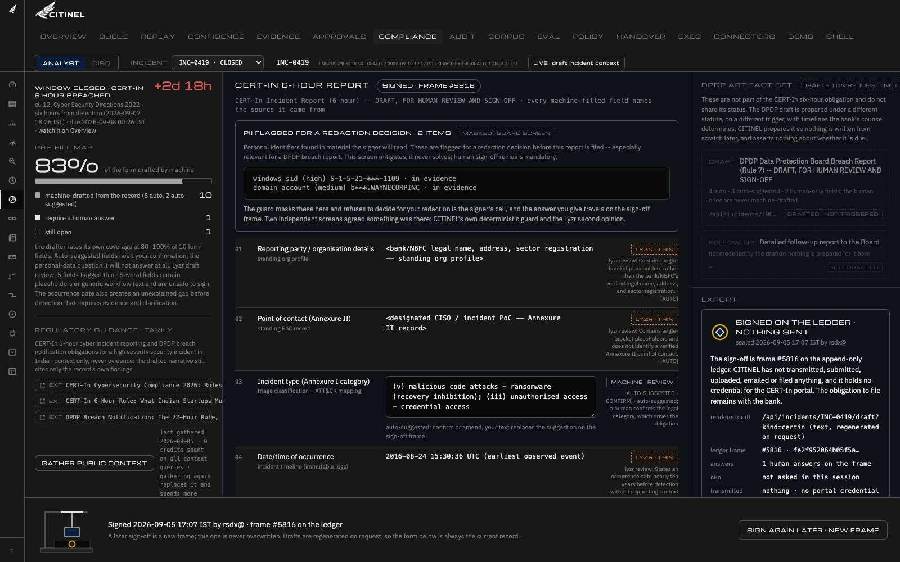

**What it is for.** The desk where CITINEL drafts the CERT-In six-hour incident report (under clause 12 of the 2022 Cyber Security Directions) and the DPDP breach report (under India's personal-data law) from the incident record. Every machine-filled field names the record it came from. A human reviews the drafted fields, answers the questions CITINEL refuses to answer, types their name, and signs the draft on the ledger. Nothing is sent anywhere. Filing with the regulator remains the bank's act.

**Borrowed instrument.** A seal press, drawn at the bottom of the screen. When a named human has answered every open field, typed their name and ticked the accuracy statement, the button **DRIVE THE SEAL** lowers the press head for about a second while the sign-off is written to the ledger; a sealed mark then appears on the drawn page.

**What to look at.**
- The clock in the left rail, **IN FORCE · CERT-IN 6 HOUR**, counting six hours from detection, with *cl. 12, Cyber Security Directions 2022* beneath it. It turns to **WINDOW CLOSED · CERT-IN 6 HOUR BREACHED** if the window passes.
- **PRE-FILL MAP**: a big percentage *of the form drafted by machine*, and under it the counts with their denominator: *machine-drafted from the record (N auto, M auto-suggested)*, *require a human answer*, *still open*.
- **INCIDENT ARC**, with the note that the arc cannot close on this screen because *Closed means a named human signed off, and filing is the bank's act; CITINEL drafts and stops*.
- **CERT-IN 6-HOUR REPORT**: the numbered fields, each stamped **MACHINE**, **MACHINE · REVIEW**, **HUMAN REQUIRED**, **ANSWERED BY HUMAN** or **AWAITING SEAL**, with the source named beside every machine-filled row. The row *Was customer personal data affected?* carries the hint *the drafter refuses to answer this*.
- **PII FLAGGED FOR A REDACTION DECISION** with the chip **MASKED · GUARD SCREEN**: personal identifiers the deterministic guard found, masked, with redaction left as the signer's call.
- **DPDP ARTIFACT SET**: one **DRAFT** card for the DPDP breach report, *prepared under a different statute, on a different trigger*, and one **FOLLOW-UP** card marked **NOT DRAFTED**.
- **REGULATORY GUIDANCE · TAVILY**, public CERT-In and DPDP guidance gathered from the open web, marked *context only, never evidence*.
- **SIGN-OFF · THE HUMAN STEP**: the name box, the accuracy tick box, and a button that reads **SEAL LOCKED** until every human field is answered, then **DRIVE THE SEAL**. After signing, the export panel reads **SIGNED ON THE LEDGER · NOTHING SENT** and the row *transmitted: nothing · no portal credential exists on this system*.
- The footer: *CITINEL drafts, a human signs, the bank files. There is no configuration of this product in which the third step is ours.*

**What this screen proves.**
- `H4` **Regulator-ready compliance clock.** When an incident is confirmed, the CERT-In and DPDP drafts are assembled from the live record for a human to sign, with the six-hour clock counting from detection. The draft is ready before the human sits down, and the human still decides.
- `U8` **Built before the duty bites.** The DPDP breach-report draft exists ahead of that duty coming into force (Rules notified 13 November 2025, Rule 7 about eighteen months later), so a bank can rehearse the form now. Verified against the primary Gazette text.
- `U20` **A poisoned log cannot launder itself into the signed draft.** An attacker's planted string can survive investigation and reach the draft, but only inside a visible fence that says where it came from, reproduced exactly, with no field resting on it. A report that quietly edited the record would be a false record.
- `H3` **The quarantine plane**, at the point where it matters most: the document a human signs.

*Said here, not shown here.* No named competitor in a 2026 twelve-platform agentic-SOC comparison mentions CERT-In, DPDP, RBI or SEBI (`U6`), and the closest public claim to auto-draft the DPDP breach PDF with a dual clock failed adversarial verification nought to three (`U7`). This desk is the white space those two findings describe.

**What it does not claim.**
- The CERT-In drafter defines 10 fields: 8 filled automatically and 2 auto-suggested for a human to confirm. The personal-data question is not among them; the machine refuses it, and the form on the glass adds it and the signature line as two further rows. The DPDP draft defines 9 fields: 4 automatic, 3 suggested, 2 that only a human may write.
- Signing writes a frame on the append-only ledger. It files nothing, transmits nothing, and the service holds no credential for the CERT-In portal. Export to a printable form unlocks after signing; the bank files it.
- The DPDP draft is marked **DRAFTED ON REQUEST · NOT TRIGGERED** until the human answers yes to the personal-data question. The follow-up report to the Board is not drafted.
- The *Actions taken and containment* field reads from the response log, and every response action hit a simulated endpoint.
- After signing, the page asks n8n to run the post-sign-off flow and shows which channels it reports. On the live deployment the GitHub ticketing leg works; the Swytchcode Slack messaging leg does not, and the ledger records that gap as `not_configured` rather than claiming a message was sent.
- The seal only writes if the device was first armed in Settings with the operator token. Cold load can take up to about 50 seconds while the drafter and both guards run; if the live draft does not load, sample content appears under a red **AUTHORED DEMO** banner and the seal writes nothing.

#### 10. Report

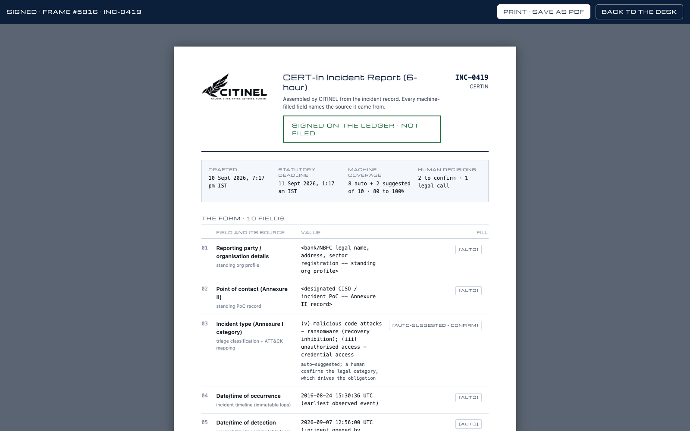

**What it is for.** The printable filing form, drafted from the incident record, that a bank would send to CERT-In or to the Data Protection Board of India. Every machine-filled field names the source it came from. The page carries a red **DRAFT** stamp until a named human signs on the ledger, and even then it is marked **NOT FILED**, because the bank files it, not CITINEL.

**Borrowed instrument.** The statutory forms themselves, quoted as printed on the page: the CERT-In Directions No. 20(3)/2022-CERT-In of 28 April 2022 under Section 70B(6) of the Information Technology Act, 2000, and Rule 7 of the Digital Personal Data Protection Rules, 2025, operationalising Section 8(6) of the DPDP Act, 2023.

**What to look at.**
- The stamp **DRAFT · FOR HUMAN REVIEW AND SIGN-OFF**, which changes to **SIGNED ON THE LEDGER · NOT FILED** after signing.
- **MACHINE COVERAGE**, which prints how many fields were filled automatically and how many suggested, always out of the total, and **HUMAN DECISIONS** beside it.
- **HOW THIS IS SUBMITTED**: *CITINEL drafts and a named human submits. There is no machine filing route.* For the CERT-In form it lists the three published channels: email, phone and fax.
- **STATUTORY BASIS AND CLOCK**: the direction or rule the form is made under and its deadline, 6 hours of noticing for CERT-In or 72 hours for the DPDP detailed report, each sentence carrying the research finding id it came from.
- **QUARANTINED CONTENT CARRIED INTO THIS FORM**, shown only if attacker text reached the draft, in a red fence captioned **UNVERIFIED · ATTACKER-SUPPLIED TEXT · REPRODUCED VERBATIM**.
- The **SIGN-OFF** block, which reads **UNSIGNED** until a person signs and then names who, when, and the ledger frame number. The one control in the top bar is **PRINT · SAVE AS PDF**.

**What this screen proves.**
- `H4` **The compliance clock, printed.** This page is the drafted form itself, assembled from the live record, with the statutory deadline and the rule that sets it. The six-hour CERT-In clock starts when the bank notices the incident, not when the investigation ends, and a form drafted from the record as it stands is what makes that deadline reachable.
- `U8` **Pre-enforcement readiness, cited on the page.** The page prints the direction or rule, when it was issued and came into force, and the finding id each sentence was taken from.

**What it does not claim.**
- CITINEL drafts only. A named human signs, the bank files. The footer says so on every printed page.
- The guard flags and masks personal identifiers, but it does not decide what to redact. That decision, and the legal question of whether personal data was breached, are the signer's.
- The submission channels printed are the project's researched record, not legal advice; the page tells the reader to verify them against the regulator's current guidance.
- The draft takes time to assemble: about 17 seconds on a warm service, up to 50 on a cold one, with the elapsed time shown while waiting. If no draft can be read it prints a notice, never a blank form.

### Prove and improve

#### 11. Audit

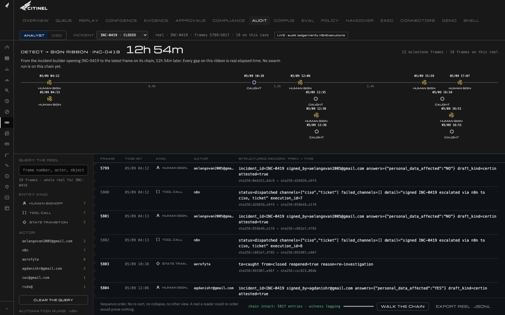

**What it is for.** The full record of what the system did on one incident, in the order it happened. The record is append-only: entries can be added but never edited or removed. Each entry carries the hash of the entry before it, so altering or removing any one entry breaks the chain. A separate service, the external witness, keeps its own count of entries, so swapping the whole file for a different one is also detected.

**What to look at.**
- **QUERY THE REEL**, to find one frame by its number, actor or hash.
- The columns **FRAME**, **TIME IST**, **KIND**, **ACTOR**, **STRUCTURED RECORD · PREV → THIS**, showing each entry with the hash of the one before it and its own.
- **THE LEDGER IS NOT THE MODEL**, with its **RECORDED** and **NEVER RECORDED** lists. A model's reasoning is never recorded.
- **WALK THE CHAIN**, which re-checks every hash link on the server and prints *chain intact* or *chain broken*, with the witness's own status beside it.
- **AUTOMATION RUNS · n8n**, which reads run history back from n8n over its own API, or says plainly that the API plane is not configured. Those runs are not ledger entries and are not hash-chained.

**What this screen proves.**
- `KD3` **A hash-chained ledger with an independent witness.** Chain verification proves no single entry was altered; the external witness proves the record as a whole was not substituted, an attack the chain check alone cannot see.
- `U5` **The audit record is separate from the AI's reasoning.** The screen says so in a named panel. A judge can distinguish what the system recorded about itself from what a model said it observed.

**What it does not claim.**
- The witness is a third-party service and may time out. When it does, the screen prints *witness unavailable* beside the chain result rather than assuming the witness agrees.
- The chain check proves the entries were not altered, removed or swapped; it does not judge whether the decisions those entries record were right. The ledger records that a verdict was produced and verified, not the verdict's text.
- Every response action on the reel ran against a simulated endpoint; the records themselves carry `simulated=true` and mock endpoint names.
- On the live deployment the Swytchcode Slack leg does not work and the ledger records it as `not_configured`; the GitHub ticketing leg does work.
- Actions taken on the demo screens during a browser session are not written to the service ledger, and the reel says so.

#### 12. Corpus

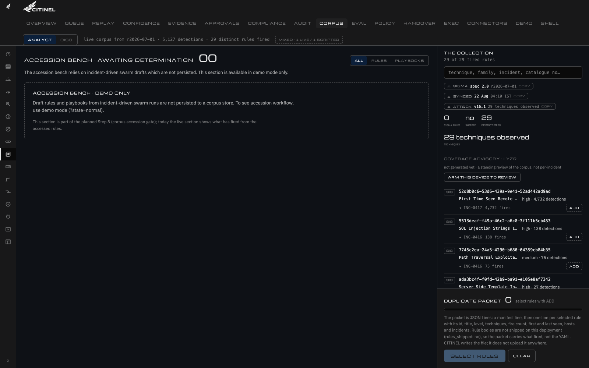

**What it is for.** The library of detection rules CITINEL runs, the bench where machine-drafted rules wait for a human to accept, revise or reject them, and an export control that writes a copy of selected rules to the analyst's own machine and sends nothing anywhere.

**What to look at.**
- **ACCESSION BENCH · AWAITING DETERMINATION**, with the three determinations **ACCESSION**, **REVISE**, **REJECT**.
- **THE COLLECTION**: the pinned Sigma release and the 29 rules that fired on the record, each with its count, techniques, hosts and incidents.
- **COVERAGE ADVISORY · LYZR**, an outside agent's opinion on gaps in rule coverage.
- **DUPLICATE PACKET**, and after export, **PACKET WRITTEN · NOT SENT**.

**What this screen proves.**
- `U16` **Nothing joins the collection unreviewed.** Machine-drafted detection rules wait on the accession bench until a human gives one of three determinations. A human, not the machine, decides which new rules are trustworthy.
- `U14` **The detection content leaves with the bank.** Rules and playbooks export in Sigma, an open shared format many security tools read, with no licence tier to unlock first. The master list draws the contrast with a comparable open-source tool whose free tier now requires registration and turns read-only after a trial.
- `U15` **Open, no-lock-in SOC software has a commercial precedent.** Wazuh, released under the GPL, already shows that an open security platform can be a viable business at the infrastructure layer. CITINEL applies the same idea one layer up, at analysis and response, where no comparable open precedent exists.
- `U17` **Paying for detection content is a tested pattern.** A working business that monetises community-written detection rules has existed since 2019, so a contributor programme would not rest on an untested economic bet.

*Said here, not shown here.* Durable improvement in agentic systems comes from changes to prompts, memory and control logic rather than retraining (`U25`). The corpus and the rulebook are where CITINEL's corrections live, which is why improving it is fast and reversible.

**What it does not claim.**
- On the live deployment the accession bench is empty and reads **ACCESSION BENCH · DEMO ONLY**: draft rules from incident runs are not stored, so the accept, revise or reject workflow appears only in demo mode.
- On the live deployment the export writes a JSON Lines file of what fired, with rule ids that point to the pinned release, not the rule text itself. The rule bodies are not shipped in the container. In both modes the browser writes the file to the analyst's downloads folder and nothing is sent anywhere.
- The Lyzr advisory advises only. It cannot block or approve anything, and nothing it says counts as evidence. Asking for a fresh advisory needs an armed device; a read-only viewer sees **ARM THIS DEVICE TO REVIEW**.

#### 13. Eval

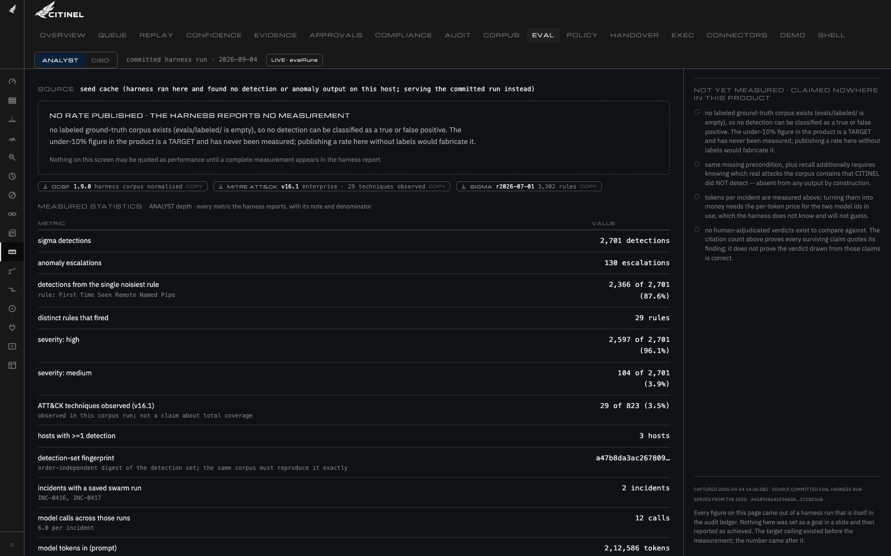

**What it is for.** What the system measured, and what remains unmeasured, in the same table. A judge reads it to confirm that the product refuses to claim a performance figure without showing the population it was calculated from.

**What to look at.**
- **MEASURED STATISTICS**, with the **METRIC** and **VALUE** columns: 2,701 Sigma detections, 130 anomaly escalations, 29 distinct rules fired, 2,366 of 2,701 detections from the single noisiest rule, 29 of 823 ATT&CK techniques observed, 14 of 14 claims surviving citation verification across the two saved swarm runs, and the detection-set fingerprint that a re-run must reproduce exactly.
- **MEASUREMENT SCOPE**: the deterministic layers, plus token and citation counts read from saved swarm runs. Verdict quality is not evaluated.
- **NOT YET MEASURED · CLAIMED NOWHERE IN THIS PRODUCT**: the false-positive rate, recall, cost per incident in rupees, and verdict quality, each with the reason and what would be needed to measure it.
- **NO RATE PUBLISHED · THE HARNESS REPORTS NO MEASUREMENT**.

**What this screen proves.**
- `KD10` **No measurement without its denominator.** Every rate is written as a count out of the total it was measured on, and the percentage appears only beside that fraction, never on its own. Plain counts carry their unit. This stops a small win from being inflated by hiding how few cases it came from, and the same rule refuses to print a false-positive rate that nobody has measured.

**What it does not claim.**
- The false-positive rate is unmeasured. Industry runs 46 to 80 percent by published survey; CITINEL targets under 10 percent and will publish a measured rate on labelled data rather than claim one now. The labelled set it needs is described in `evals/labeled/README.md`, and the folder is empty.
- The harness measures the deterministic layers only. The AI agents are not measured by it.
- The 14 of 14 citation figure is mechanical: every quoted span was found in the finding it cites. It is not a judgement of whether the verdict is right.
- If the service does not answer, the screen shows nothing in its place. In its own words, a figure it cannot read is a figure it does not have.

### Operate and report

#### 14. Handover

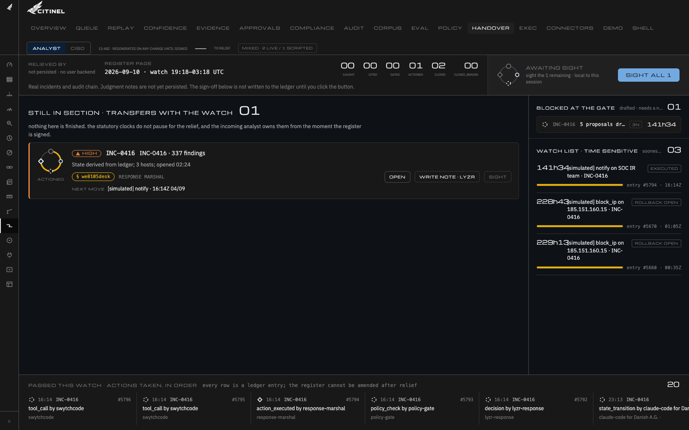

**What it is for.** A security operations centre works in shifts. This screen shows what the outgoing analyst completed and what the incoming analyst now owns. The note is built from the ledger, the system's own record of every action, rather than from the outgoing analyst's memory, so nothing is lost at the shift change. The Lyzr handover agent draws only from the ledger for the same reason.

**What to look at.**
- **STILL IN SECTION · TRANSFERS WITH THE WATCH**.
- **BLOCKED AT THE GATE**.
- **WATCH LIST · TIME SENSITIVE**, the records whose statutory clocks are closest.
- **PASSED THIS WATCH · ACTIONS TAKEN, IN ORDER**.
- **REGISTER PAGE**, and the arc-into-ring device on each card, reused here because a handover is honestly about how far each record has travelled.

**What this screen proves.** The knowledge base lists no catalogued differentiator for the Handover screen. Its value is the principle behind it: the handover comes from the record, not from memory, which is the same principle that makes the compliance draft trustworthy.

**What it does not claim.**
- Judgment notes are not yet persisted. The analyst's sight marks and sign-off are kept only in the browser for this session.
- There is no user backend, so the **RELIEVED BY** field shows *not persisted · no user backend* instead of a name.
- Signing the register never reaches the ledger. The button reads **SIGN THE REGISTER · THIS SESSION** and the note beside it says the sign-off is local to this session; there is no register route on the server yet.

#### 15. Executive

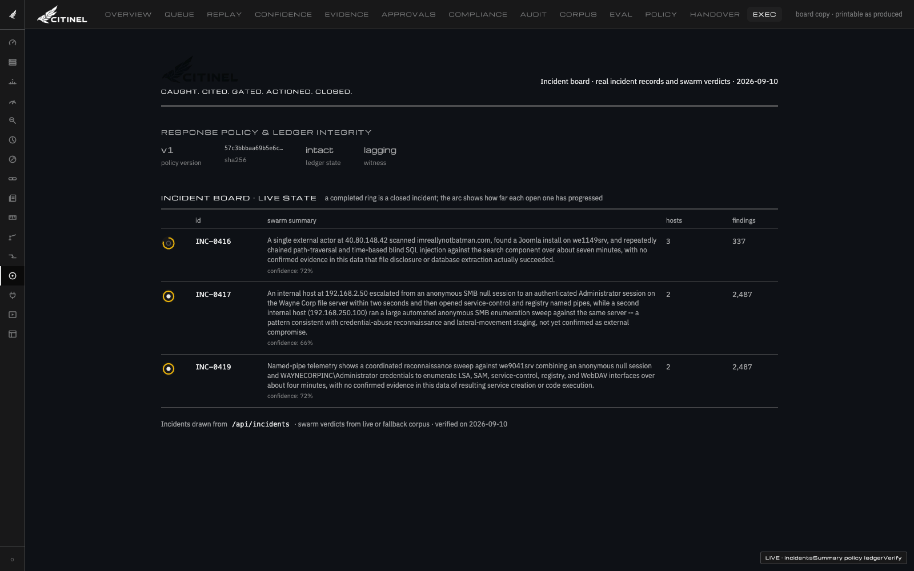

**What it is for.** The board copy. It lists the incidents on record, each with a one-line summary written by the swarm, and above them the version and fingerprint of the response rulebook and whether the audit ledger is still intact. It is laid out to be printed as it is and read by a director or a regulator. It is a copy for reading, not a filing: the page has no send or file control.

**What to look at.**
- The header label *board copy · printable as produced*.
- **CAUGHT. CITED. GATED. ACTIONED. CLOSED.** under the mark, and the dated line *Incident board · real incident records and swarm verdicts*.
- **RESPONSE POLICY & LEDGER INTEGRITY** with four figures: *policy version*, *sha256*, *ledger state* and *witness*.
- **INCIDENT BOARD · LIVE STATE**, with the caption *a completed ring is a closed incident; the arc shows how far each open one has progressed*, and the columns *id*, *swarm summary*, *hosts*, *findings*.
- The footnote naming the web address the figures come from, and the small corner badge that reads **LIVE** with the three sources it read, or **DEMO DATA** when the service was not reached.

**What this screen proves.** No catalogued differentiator is evidenced by pixels here; the board copy restates what the other screens prove, in the form a director reads.

*Said here, not shown here.* The board copy is where the buyer's economics get discussed, and five researched claims belong to that conversation. The closest comparable incumbent has pulled all pricing behind a sales-quote wall, so CITINEL's transparent price band is a structural contrast (`U10`). A competitor's own pricing page caps a tier at the average output of a human tier-1 analyst, which independently validates the cost baseline CITINEL undercuts (`U11`). Even the incumbent's last disclosed price sits an order of magnitude above the Indian buyer band, presented as a historical comparator because the current price is not public (`U12`). SEBI's CSCRF directs the exchanges to run Market-SOCs that onboard small regulated entities, a distribution structure a regulator already built and no named competitor is documented as targeting (`U13`). And the PACS computerisation programme, 63,000 societies at ₹2,516 crore, approved 29 June 2022, is a live government-funded digital rail for exactly this segment (`U23`).

**What it does not claim.**
- The one-line *swarm summary* is the agents' headline, not evidence. The cited log lines behind it are on Replay, and the reasons for each *confidence: NN%* figure are on Confidence.
- The board does not show whether any proposed action was carried out, and in any case every response action runs against a simulated endpoint.
- If the service cannot be reached, the page swaps in example rows written into the page itself and only the corner badge changes, to **DEMO DATA**. *Verified on* in the footnote is the date the page was loaded, not the date of an independent audit.

#### 16. Connectors (Settings)

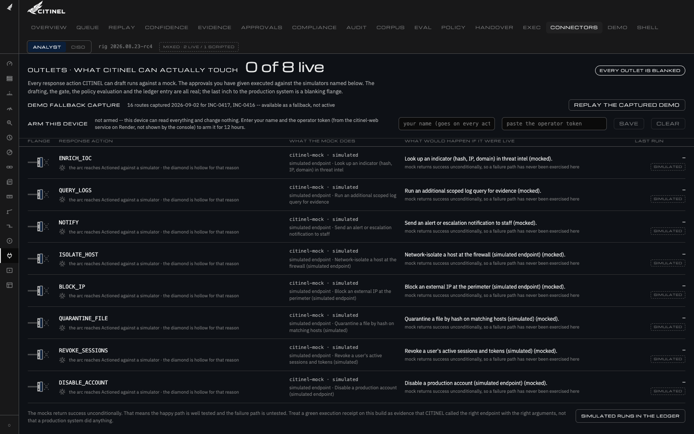

**What it is for.** The declaration of every external service CITINEL can receive data from and send actions to, and the one place where a device is armed to write. It shows that all response actions are directed to simulated systems only, never to real bank infrastructure, and it says so in the largest type on the page: **0 of 8 live**.

**What to look at.**
- **OUTLETS · WHAT CITINEL CAN ACTUALLY TOUCH**, the eight response-action classes, each with a **FLANGE** column showing a blanking plate, **WHAT THE MOCK DOES**, **WHAT WOULD HAPPEN IF IT WERE LIVE** and **LAST RUN**.
- The badge **EVERY OUTLET IS BLANKED**.
- **INLETS · WHAT FLOWS IN**, the sixteen connectors and their live status, and **HEADER TANK · ENRICHMENT BUDGET**, the per-day allocation for reputation lookups.
- **ARM THIS DEVICE**: an operator name, the operator token, **SAVE** and **CLEAR**. Once saved, the rail shows a green dot and the name for twelve hours, and every write carries that name onto the ledger.
- **DEMO FALLBACK CAPTURE**: sixteen routes captured on 2 September for two incidents, available as a fallback and clearly marked not active.
- The footer: *The mocks return success unconditionally. Treat a green execution receipt on this build as evidence that CITINEL called the right endpoint with the right arguments, not that a production system did anything.*

**What this screen proves.**
- `KD5` **A deterministic exact-host egress allow-list.** Outbound calls go only to six exact hostnames over HTTPS (`api.anthropic.com`, `www.virustotal.com`, `api.abuseipdb.com`, `api.tavily.com`, `generativelanguage.googleapis.com`, `www.startuped.ai`). Operator-configured destinations such as Lyzr and n8n are pinned to their configured host, and Swytchcode, GitHub and Slack are reached through a policy-gated command line, never by direct HTTP. A poisoned log cannot redirect traffic to an attacker's server.
- `KD7` **A privacy boundary in code.** The analytics connector accepts five aggregate counts and refuses any field that could carry incident content. Refusal, not redaction: the field is rejected. `GET /api/startuped/signals` publishes exactly what is sent.
- `KD9` **Fail-closed writes with distinguishable failures**, exercised from this screen's **ARM THIS DEVICE** control. Clear the token and attempt a write: the server returns 401, *This device is not armed*. A deployment with writes switched off returns 503. An operator can tell *not configured* from *not authorised* without inspection.
- `H3` **The quarantine plane's outer wall.** The allow-list is the layer that stops hostile text from reaching out.

*Said here, not shown here.* No single defence is robust across every axis, and the field is converging on hybrid, multi-layer defences (`U29`). The allow-list on this screen is one layer of four: quarantine, detector, allow-list, human gate.

**What it does not claim.**
- Response actions hit simulated endpoints only, never real systems. The eight blanking plates are the honest picture of this build.
- The Slack messaging transport is not configured on the live deployment; GitHub ticketing is.
- Sign-offs are drafts; a named human signs and the bank files.
- The false-positive rate is unmeasured.

#### 17. Demo

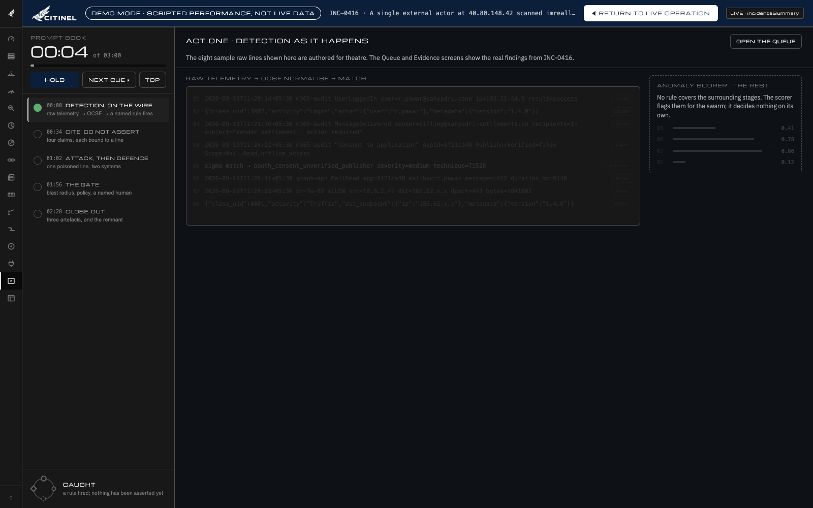

**What it is for.** A scripted walkthrough that plays the same fixed trace every time. It shows logs coming in, being converted to one standard shape (OCSF, so a Windows log and a firewall log look alike), and being matched against written rules for known attacks. It then follows one attacker-written log line through investigation, the approval gate and into the draft report a human signs. It teaches the mechanism before the live incident screens are shown, and its banner says it is not live data.

**What to look at.**
- **DEMO MODE · SCRIPTED PERFORMANCE, NOT LIVE DATA**, read first.
- **PROMPT BOOK**, the cue column, and **NEXT CUE ▸**.
- **RAW TELEMETRY → OCSF NORMALISE → MATCH**, then **DETERMINISTIC MATCH · RULE FIRED**, with the rule id and corpus revision.
- **THE LINE BOTH SYSTEMS RECEIVE · IDENTICAL BYTES**: a naive agent and CITINEL are handed the same poisoned line, and only one of them obeys it.
- **THE REMNANT, INSIDE THE DRAFT THE HUMAN SIGNS**.
- **WHAT THIS DOES AND DOES NOT SHOW**, the disclosure panel, which says injection is *mitigated here, not eliminated*.

**What this screen proves.**
- `U9` **The deterministic floor, on the glass.** *A named Sigma rule matched line 04 exactly. No model was involved in this decision and none was needed.* The Queue screen states the same property in its own heading, so a judge can check it twice.
- `U20` **Anti-laundering through signature, end to end.** One log line carries hidden instructions written by an attacker. At every step it is still marked as untrusted input and shown escaped, so it cannot turn itself into an instruction the system obeys or a claim the report makes. It is still in the draft, because that really was the app's name and a report that edited it out would be a false record.
- `H1` and `H3` **The glass-box pipeline and the quarantine plane**, taught in five acts before the live screens show them for real.

**What it does not claim.**
- This is a scripted walkthrough of a fixed trace. The eight raw lines are, in the page's words, *authored for theatre*, and acts two, three and five are labelled **SCRIPTED FOR DEMONSTRATION**. The naive-agent comparison has no real backend equivalent. The Queue, Replay, Evidence, Approvals and Compliance screens hold the real record, and the page links to each.
- The four response actions in the gate act are theatre; every response action in CITINEL hits simulated endpoints.
- The close-out artefacts are theatre. In reality CITINEL drafts, a human signs, and the bank files.
- Nothing here measures the false-positive rate.

### Where each of the forty lives

Ten checkable in code (`KD`), thirty researched (`U`), four headline compositions (`H`). *Shown* means a judge can see it on that screen; *said* means it is a researched claim deployed under questioning at that screen.

| Code | Name | Screen | How |
|---|---|---|---|
| `KD1` | Quote-bound claim elimination gate | 4 Replay | shown |
| `KD2` | Payload-level evidence class tagging | 4 Replay, right column | shown |
| `KD3` | Hash-chained ledger with external witness | 11 Audit | shown |
| `KD4` | Inter-agent provenance fencing | 4 Replay | shown |
| `KD5` | Deterministic exact-host egress allow-list | 16 Connectors | shown |
| `KD6` | Declared blind-spot closure sweep | 4 Replay, right column | shown |
| `KD7` | Field-refusing telemetry privacy boundary | 16 Connectors | shown |
| `KD8` | Rollback-tokened blast-radius policy gate | 8 Approvals | shown |
| `KD9` | Fail-closed distinguishable write denial | 16 Connectors, ARM THIS DEVICE | shown |
| `KD10` | Denominator-mandatory metric rendering | 1 Overview, 13 Eval | shown |
| `U1` | Per-claim log-line citation requirement | 4 Replay | shown |
| `U2` | Injection-resistant foundation model selection | 4 Replay | said |
| `U3` | Human-readable policy-as-code gating | 7 Policy | shown |
| `U4` | Counter-evidence-paired confidence disclosure | 5 Confidence | shown |
| `U5` | Reasoning-independent audit substrate | 11 Audit | shown |
| `U6` | India-regulator form drafting white space | 9 Compliance | said |
| `U7` | Adversarially refuted competitor parity claim | 9 Compliance | said |
| `U8` | Pre-enforcement regulatory clock readiness | 9 Compliance, 10 Report | shown |
| `U9` | LLM-independent deterministic detection floor | 2 Queue, 17 Demo | shown |
| `U10` | Transparent price band against quote-walls | 15 Executive | said |
| `U11` | Competitor-sourced human-analyst cost benchmark | 15 Executive | said |
| `U12` | Order-of-magnitude buyer-band displacement | 15 Executive | said |
| `U13` | Regulator-built B2B2X distribution channel | 15 Executive | said |
| `U14` | Licence-free portable detection export | 12 Corpus | shown |
| `U15` | Proven open-core SOC viability precedent | 12 Corpus | shown |
| `U16` | Mandatory human accession review gate | 12 Corpus | shown |
| `U17` | Precedented detection-content bounty economics | 12 Corpus | shown |
| `U18` | Per-action-class autonomy assignment | 7 Policy, 8 Approvals | shown |
| `U19` | Day-one blast-radius ring design | 8 Approvals | shown |
| `U20` | Anti-laundering quarantine through signature | 6 Evidence, 9 Compliance, 17 Demo | shown |
| `U21` | Risk-calibrated trust dial evidence | 7 Policy | said |
| `U22` | Calibrated self-assessment trust uplift | 5 Confidence | shown |
| `U23` | Government-funded PACS distribution rail | 15 Executive | said |
| `U24` | Confabulation-resistant aggregation design choice | 4 Replay | said |
| `U25` | Scaffolding-level reversible improvement loop | 12 Corpus | said |
| `U26` | Anti-corruption layer boundary pattern | 6 Evidence | said |
| `U27` | Self-verification refusal by architecture | 4 Replay | said |
| `U28` | Base-model attack inheritance mitigation | 6 Evidence | said |
| `U29` | Multi-layer hybrid defence convergence | 16 Connectors | said |
| `U30` | Low-latency consensus reference protocol | 4 Replay | said |
| `H1` | Glass-box cited triage pipeline | 2, 4, 17 | composed of KD1, KD4, U1, U9 |
| `H2` | Readable per-class autonomy dial | 7, 8 | composed of KD8, U3, U18, U19 |
| `H3` | Injection-hardened quarantine plane | 6, 9, 16, 17 | composed of KD2, KD5, U20, U28 |
| `H4` | Regulator-ready compliance clock | 9, 10 | composed of U6, U7, U8 |

---

## Partners: what each one does, and how it meets its track's criteria

Eleven external services are wired into the product's own code, and ten of them are proven with real calls on the live deployment. The eleventh, Slack, is built and proven on a developer machine but not configured on the live deployment, and the product says so rather than pretending. Six services sit behind the exact-host egress allow-list; Lyzr's and n8n's hosts are pinned to their configured URLs; Swytchcode, GitHub and Slack are reached through a policy-gated command line, never by direct HTTP. Render hosts all of it.

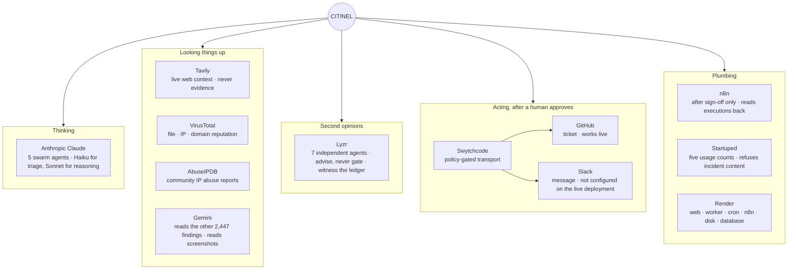
```mermaid
flowchart TB
  subgraph THINK["Thinking"]
    AN[Anthropic Claude<br/>5 swarm agents · Haiku for triage, Sonnet for reasoning]
  end
  subgraph LOOK["Looking things up"]
    TV[Tavily<br/>live web context · never evidence]
    VT[VirusTotal<br/>file · IP · domain reputation]
    AB[AbuseIPDB<br/>community IP abuse reports]
    GM[Gemini<br/>reads the other 2,447 findings · reads screenshots]
  end
  subgraph CHECK["Second opinions"]
    LY[Lyzr<br/>7 independent agents · advise, never gate · witness the ledger]
  end
  subgraph DO["Acting, after a human approves"]
    SW[Swytchcode<br/>policy-gated transport] --> GH[GitHub<br/>ticket · works live]
    SW --> SL[Slack<br/>message · not configured on the live deployment]
  end
  subgraph PLUMB["Plumbing"]
    N8[n8n<br/>after sign-off only · reads executions back]
    ST[Startuped<br/>five usage counts · refuses incident content]
    RD[Render<br/>web · worker · cron · n8n · disk · database]
  end
  CORE((CITINEL))
  CORE --> THINK
  CORE --> LOOK
  CORE --> CHECK
  CORE --> DO
  CORE --> PLUMB
```

### At a glance

| Partner | What it does in CITINEL | Track criteria, in one line | Status on the live deployment |
|---|---|---|---|
| Anthropic | The five thinking agents | model tiering, live model verification, injection resistance | proven live |
| Lyzr | Seven independent checking agents and the ledger witness | seven distinct roles, genuine independence, honest failure, hardened instructions | proven live, all seven |
| Tavily | Live public context for techniques and regulations | all five API primitives, real-time retrieval, creative use | proven live |
| Google Gemini | Wide-lens sweep of unexamined findings; reads screenshots | long context, vision, observation is not fact, honest failure, key hygiene | proven live |
| n8n | Post-sign-off automation, read back as evidence, self-hosted on Render | three-direction integration, auditable automation, inverted approval, glue not gate | proven live, both planes |
| Swytchcode | Policy-gated transport to GitHub and Slack | CLI, Python runtime, two ecosystem APIs, AI agent, policy gate | ticketing proven; messaging not on live |
| VirusTotal | File and IP reputation for the Enricher | reputation data, cache-first under rate limits | proven live |
| AbuseIPDB | Community IP abuse confidence for the Enricher | community reports, daily budget | proven live |
| Startuped | Five aggregate usage signals, nothing else | Signal API, privacy boundary, five GTM modules | signals proven live; modules not yet run |
| Render | Hosts the web service, worker, cron, n8n, disk and database | blueprint, persistent disk, cron, health check | proven live |

### Anthropic

Provides the Claude models for the five thinking agents. Two models are used: Haiku for triage, because it is cheap and the question is small, and Sonnet for reasoning. Both model ids are verified live at startup against the API, and the Overview fleet panel shows which model each role used and how many tokens it spent. **Why this one:** the strongest measured resistance to log-based prompt injection in independent 2026 benchmarking.

| Criterion | What is built | Where a judge looks | Status |
|---|---|---|---|
| Model availability and verification | Two pinned model ids (Haiku for triage, Sonnet for reasoning) checked live at startup against the models endpoint | `backend/citinel/agents/models.py`; **AGENT FLEET** on Overview | proven live |
| Prompt-injection resistance | The model family recorded a 0.0 percent verbatim-hijack rate against up to 86.2 percent for the worst tested model | [docs/CITINEL-UVP-MASTER-LIST.md](docs/CITINEL-UVP-MASTER-LIST.md), item 2 | one preprint, illustrative |
| Cost discipline | Cheap model first, expensive model only when needed; tokens per incident measured on Eval (106,293 in and 28,731 out per incident across two saved runs) | Eval screen; `GET /api/eval` | proven live |

**Honest limits.** There is no fallback model if the API is unavailable; the deterministic layer is what keeps known-threat detection running in that case (`U9`). The benchmarking behind the model choice is one non-peer-reviewed preprint with thirty trials per model.

###  Lyzr

Seven independent AI agents, built in Lyzr Studio, that audit and check CITINEL's own agents from outside: a second opinion on triage, on citation support, on drafted compliance fields, on the proportionality of a proposed action, on corpus coverage, a shift-handover note drawn only from the ledger, and the ledger witness that keeps its own count of entries. **Why this one:** independence. A second opinion inside the same system, with the same model and the same blind spots, proves nothing; an external vendor checking from outside closes a real gap.

| Criterion | What is built | Where a judge looks | Status |
|---|---|---|---|
| Seven independent agents in distinct roles | Each holds its own Studio agent id and runs one real seam: Triage, Review, Handover, Verdict Auditor, Response Reviewer, Corpus Advisor, Ledger Witness. All seven report configured on the live deployment | `GET /api/connectors`; [LYZR-QUALIFICATION.md](LYZR-QUALIFICATION.md) §1; `backend/citinel/connectors/lyzr_agents.py` | proven live |
| Second opinions are genuinely independent | The triage agent sees the same evidence as the Router and answers separately; disagreement is recorded on the ledger. The verdict auditor is told to form its view before reading CITINEL's own estimate | Replay shows the **2ND OPINION** milestone; `GET /api/incidents/INC-0417/audit`, actor `lyzr-triage` | proven live |
| External ledger witness for tamper detection | A separate count of ledger entries kept outside the process, so wholesale file replacement is detectable | Audit screen, **WALK THE CHAIN**; `GET /api/ledger/verify`, `witness` field; `backend/citinel/connectors/lyzr.py` | proven live |
| Fails honestly and degrades gracefully | An unset agent reports `not_configured` while the others run; unreachable reports `unavailable`; a malformed reply degrades, with seven regression tests | `backend/tests/test_malformed_agent_replies.py` | proven live |
| Instructions adversarially hardened | One source of truth for all seven agents' instructions, each with a defence block against attacker-controlled log text; agent 1 survived eight crafted injection attempts | [LYZR-AGENT-CONFIG.md](LYZR-AGENT-CONFIG.md); [LYZR-QUALIFICATION.md](LYZR-QUALIFICATION.md) §5 | proven live |

**Honest limits.** Lyzr's memory is built for semantic recall, not byte-exact storage, so the witness has no guarantee it holds the head hash perfectly between calls; if its memory fails the result is a false *diverged*, which triggers investigation, rather than a false *agreed*, which would hide tampering, but a durable fix is still open. At the time of writing the live witness reports *lagging*, having seen 0 of 5,817 entries, which the screen states plainly is not evidence of tampering. No Lyzr output is evidence; opinions are recorded as opinions. No published criteria exist for this track, so the dossier is an evidence index rather than a checklist.

###  Tavily

Searches the live public internet for context about the attack techniques that fired and the regulations that apply, and returns real URLs with fetch timestamps. On the Compliance desk it gathers current CERT-In and DPDP guidance beside the draft. **Why this one:** the Enricher needs current public information. Threat intelligence changes daily; a committed corpus does not.

| Criterion | What is built | Where a judge looks | Status |
|---|---|---|---|
| Integrate the Tavily APIs | All five primitives: Search on every query with an answer, Extract for full CERT-In and DPDP page text, Map for the live ATT&CK taxonomy, Crawl for a technique page plus its linked pages, Research to answer a CISO's question. Map and Crawl run once per gather for a fixed cost | [TAVILY-QUALIFICATION.md](TAVILY-QUALIFICATION.md) §1; `backend/citinel/connectors/enrichment.py`; `backend/tests/test_tavily_research.py` | proven live |
| Real-time search, retrieval and knowledge augmentation | Four query kinds (technique, rule, regulatory, campaign) planned from the persisted verdict, not from a static list; regulatory text rendered inline on the Compliance desk | Replay, **PUBLIC CONTEXT · TAVILY**; Compliance, **REGULATORY GUIDANCE · TAVILY**; `GET /api/incidents/INC-0419/context` (gathered 5 September, 26 URLs) | proven live |
| Creative and impactful implementation | A research brief that answers the question a CISO actually asks, built from the investigation's findings, asynchronous by design; every result carries its query, URL and fetch time on an external citation chip; every payload is labelled `not_evidence` | `backend/citinel/agents/brief.py`; `GET /api/incidents/INC-0417/brief` | proven live |

**Honest limits.** Credits are real: one per uncached query, plus a fixed two for Map and Crawl per gather, plus one Research run. Research is asynchronous, so the brief may read *pending* on first load. No Tavily result is ever evidence; that is deliberate and permanent.

###  Google Gemini

Reads very large batches of findings in one call, and reads images. When the investigation examines 40 of 2,487 findings, Gemini sweeps the other 2,447. When an analyst forwards a screenshot of a phishing email, Gemini reads it. **Why this one:** a very long context window, cheap per token, and the only model in the stack that can ingest 2,487 findings in one call or read a screenshot.

| Criterion | What is built | Where a judge looks | Status |
|---|---|---|---|
| Wide-lens sweep of what nobody read | Reads all 2,487 findings of INC-0417 in one call. It found critical post-exploitation the 40-finding window missed (shadow-copy deletion, a malicious Office file) plus 1,348 findings on one host outside the window. A ledger frame proves the run: `seq=5778`, swept 2,487 of 2,487 | Replay, **WIDE-LENS SWEEP · GEMINI**; `GET /api/incidents/INC-0417/audit`, actor `gemini-sweep`; [GEMINI-QUALIFICATION.md](GEMINI-QUALIFICATION.md) §1 | proven live |
| Vision: the modality CITINEL could not ingest | A forwarded phishing screenshot analysed end to end; the reading is then corroborated deterministically against the record, producing entries that are either *corroborated*, with citable finding indices, or *unseen*, naming new indicators | `backend/citinel/agents/visual.py`; `backend/tests/test_gemini_vision.py` (8 tests) | proven live |
| Observation is not fact | Every reading carries `not_evidence` in its payload, and no verdict, lane or gate decision can rest on it; only the deterministic corroboration counts | `backend/citinel/connectors/gemini.py`; Replay, **WHAT THE MODEL SAW · OBSERVATION, CARRIES NOTHING** | proven live |
| Fails honestly | No key: `not_configured`, never a fabricated sweep. Prose instead of the expected shape: `error`, never a guess. Incident fully examined: `not_needed`, with zero API calls. Unsupported image type: refused before the call | `backend/tests/test_gemini_sweep.py` (11 tests) | proven live |
| Key hygiene | The API key travels in a header, never in a URL; the Gemini host is on the egress allow-list; prompts state that image and log text are data, not instruction | `backend/citinel/connectors/gemini.py`; `backend/citinel/agents/quarantine.py` | proven live |

**Honest limits.** The sweep sends compact one-line digests, not raw log text. Sweeps above 4,000 findings are truncated with a `truncated_sweep` flag. The sweep and the reading are context only; neither moves a verdict, reopens a lane or changes a gate decision. The model in use is `gemini-3.1-flash-lite`, since the free tier is Flash-only. No published criteria exist for this track, so the dossier is an evidence index.

###  n8n

Workflow automation, self-hosted on Render as its own service. When a named human signs off in CITINEL, n8n runs the playbook: notify the CISO, open a ticket, export the PDF. CITINEL reads the playbook's executions back as evidence. **Why this one:** banks already run workflow tools, so CITINEL integrates rather than replaces, and the automation becomes auditable and reversible.

| Criterion | What is built | Where a judge looks | Status |
|---|---|---|---|
| Integrate n8n in three directions | CITINEL to n8n: a webhook fires the escalation playbook and reads back which channels succeeded. n8n to CITINEL: the REST API reads playbook runs back as evidence. n8n to CITINEL again: a paused playbook asks for a human decision, and a failed one reports to the audit trail | [N8N-QUALIFICATION.md](N8N-QUALIFICATION.md) §1; `backend/citinel/connectors/n8n.py`; `backend/citinel/connectors/n8n_api.py`; `GET /api/n8n/executions` | proven live |
| Automation is auditable | Dispatch captures the execution id; executions read back with id, state, mode and timestamps; a rejected key reports 401, not an empty list; each execution and each resume decision is a ledger frame | Audit screen, **AUTOMATION RUNS · n8n**; `GET /api/incidents/INC-0417/audit` | proven live |
| The approval is inverted | The playbook parks on a Wait node and hands its resume URL to CITINEL; the analyst answers on the Approvals screen and the workflow branches on that decision. n8n holds the workflow state, CITINEL holds the human, and every resume is a ledger frame under the approver's name | `POST /api/incidents/{id}/n8n/resume`; Approvals screen | proven live |
| The SOC sees its own automation failing | An n8n Error Trigger posts to CITINEL, which records the failed workflow, the node that failed and the message against the incident | `POST /api/n8n/error` | proven live |
| Glue, never gate | The policy gate remains the sole authority. Nothing in a playbook can approve an action the gate refused. The connector refuses a non-HTTPS webhook outright | `backend/citinel/connectors/n8n.py` | proven live |
| The exported playbook | The playbook itself is committed | [connectors/n8n/citinel-beat5b.json](connectors/n8n/citinel-beat5b.json) | committed |

**Honest limits.** The Wait-node playbook must exist in n8n for the resume path to have anything to resume. An expired Wait reports *expired*, not *error*, if the workflow has already moved on. n8n API keys carry full account access outside the Enterprise plan.

###  Swytchcode

A policy-gated transport for the actions that reach outside the product after a human approves them. CITINEL proposes; Swytchcode's own policies check the proposal against business rules; only then does the call execute, to GitHub for a ticket or to Slack for a message. **Why this one:** one gated transport for many providers, so a bank can keep the ticketing and messaging it already has, with Swytchcode's policy as a second guard beneath CITINEL's own gate.

| Criterion | What is built | Where a judge looks | Status |
|---|---|---|---|
| Built with the Swytchcode CLI | The workspace is scaffolded with `swy init`; three policies pass the real validator, with certificates of validation present | [SWYTCHCODE-QUALIFICATION.md](SWYTCHCODE-QUALIFICATION.md) §1; `.swytchcode/tooling.json`; `.swytchcode/integrations/policies.json` | proven live |
| Python runtime | The `swytchcode-runtime` package is wired as the transport, a subprocess wrapper around the `swy` binary that the Docker image installs and checks at build time | `backend/citinel/connectors/swytchcode_runtime_transport.py`; [deploy/Dockerfile.web](deploy/Dockerfile.web) | proven live |
| Two ecosystem APIs | GitHub Issues for ticketing and Slack for messaging, two different jobs at two different moments | `.swytchcode/integrations/GitHub/`; `tooling.json` Slack registration | ticketing proven; messaging built, not on live |
| An AI agent in the loop | The five Claude agents propose; the seven Lyzr agents review; Swytchcode sits downstream as the execution path | [SWYTCHCODE-QUALIFICATION.md](SWYTCHCODE-QUALIFICATION.md) §4 | proven live |
| Policy gate against blast radius | Three policies: no core-banking infrastructure in a ticket, no notification without a destination, no ticket that fails to name its incident. Verified with the real binary on 4 September | `.swytchcode/integrations/policies.json`; `backend/tests/test_swytchcode_runtime.py` (16 tests) | proven live |

**Reached through Swytchcode.**

| Destination | What it is for | Status on the live deployment |
|---|---|---|
| GitHub | Opens an issue an incident responder can track; the canonical tool id `github.issue.create` is registered and working, proven with CITINEL's exact arguments on 4 September | works |
| Slack | Posts a message to the response team's channel; `slack.chat.postmessage.create` is registered and a real message was posted from a developer machine on 4 September | not configured on the live deployment |

**Honest limits.** The Slack leg needs a connected account and an OAuth login on the machine that runs it, and whether the Render container can obtain that session is unproven. The ledger records the gap as `not_configured` rather than claiming a message was sent, which is the product's own argument working in public. GitHub needs a personal access token passed per call.

### VirusTotal

An online database of file and IP reputation. The Enricher checks file hashes against its engines and IP addresses for known badness. **Why this one:** the largest public reputation corpus for files and IPs.

| Criterion | What is built | Where a judge looks | Status |
|---|---|---|---|
| Reputation data for files and IPs | Hash and IP lookups from the Enricher, recorded with what the provider actually answered | `backend/citinel/connectors/enrichment.py`; Replay, the Enricher's frame | proven live |
| Cache-first under rate limits | The free tier allows 4 requests a minute and 500 a day, so lookups are deduplicated by hash and cached | `backend/citinel/connectors/enrichment.py`; **HEADER TANK · ENRICHMENT BUDGET** on Connectors | proven live |

**Honest limits.** Free-tier limits are real. There is no alternative provider wired if VirusTotal is unavailable.

### AbuseIPDB

A community-reported IP abuse database. When an IP appears in an attack, AbuseIPDB shows how often the security community has reported it and why. **Why this one:** community reporting that VirusTotal's vendor engines do not cover.

| Criterion | What is built | Where a judge looks | Status |
|---|---|---|---|
| Community IP abuse reports | An abuse confidence score per IP, for example 100 percent over 256 reports, used by the Enricher alongside VirusTotal | `backend/citinel/connectors/enrichment.py` | proven live |
| Daily query budget | The free tier allows 1,000 checks a day, tracked on the enrichment budget gauge | **HEADER TANK · ENRICHMENT BUDGET** on Connectors | proven live |

**Honest limits.** Community-reported data only; it is different intelligence from vendor scanning, which is why both are used.

###  Startuped.ai

A go-to-market and positioning platform. CITINEL sends it anonymous usage counts only: incidents investigated, verdicts with cited evidence, actions gated, reports drafted, sign-offs. No incident detail leaves through this connector. **Why this one:** growth measurement without a privacy hole. The five signals answer the adoption funnel, and the ratio of verdicts cited to incidents investigated is a direct reading of whether the differentiating feature is being used.

| Criterion | What is built | Where a judge looks | Status |
|---|---|---|---|
| Instrumented with the Signal API | Five aggregate signals wired to product events; the route publishes exactly what is sent | `GET /api/startuped/signals`; `backend/citinel/connectors/startuped.py`; `backend/tests/test_startuped_signals.py` (10 tests) | proven live |
| Privacy boundary in code | No incident id, host, IP, finding, evidence, target or account name can leave. The connector refuses a forbidden field rather than stripping it, and a test inspects the whole serialised body for leakage. Every call is best-effort and silent on failure | [STARTUPED-QUALIFICATION.md](STARTUPED-QUALIFICATION.md) §1.2 | proven live |
| Idea validation, market research, product positioning, GTM planning, launch strategy | The inputs for all five modules are locked in the playbook; the module outputs await a run and an export | [STARTUPED-GTM-PLAYBOOK.md](STARTUPED-GTM-PLAYBOOK.md); [docs/startuped-exports](docs/startuped-exports/README.md) | not yet run |

**Honest limits.** CITINEL has no customers yet; the go-to-market plan is a plan, not a track record. Market-size estimates are presented as ranges with their assumptions, never as a single confident number.

###  Render

Hosts the whole deployment from one blueprint: the web service that serves the console and the API, the background worker that runs detection, a cron service that re-verifies the ledger every six hours, a self-hosted n8n instance with its own disk, and a managed database. There is no track dossier for hosting; the facts below are read from the blueprint.

| Criterion | What is built | Where a judge looks | Status |
|---|---|---|---|
| Infrastructure as code | One blueprint declares four services, one database, two persistent disks and a shared environment group of 38 variables, every secret by name only | [deploy/render.yaml](deploy/render.yaml) | proven live |
| The record survives a redeploy | The ledger and every artifact a run produces live on a persistent disk at `/var/citinel`; a frame written on 3 September was still there after four redeploys | `citinel-web`, disk `citinel-ledger` | proven live |
| Unattended integrity check | A cron service walks the hash chain every six hours | `citinel-ledger-watch`; `backend/citinel/ops/ledger_watch.py` | proven live |
| Health and read-only pre-flight | A health-check path, and a script that prints GO or names the fault, with GET requests only | `/healthz`; [scripts/preflight.py](scripts/preflight.py) | proven live |

---

## Where it runs

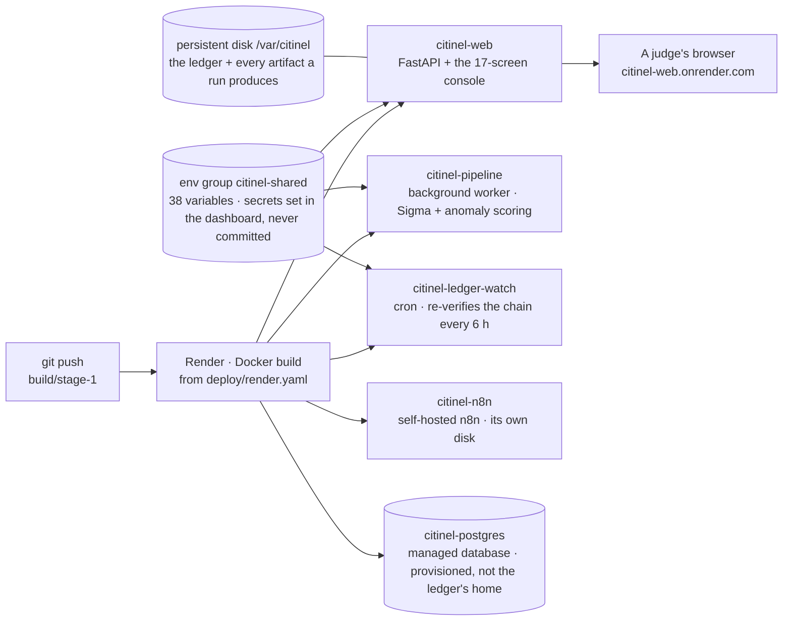
```mermaid
flowchart LR
  DEV[git push<br/>build/stage-1] --> R[Render · Docker build<br/>from deploy/render.yaml]
  R --> WEB[citinel-web<br/>FastAPI + the 17-screen console]
  R --> WK[citinel-pipeline<br/>background worker · Sigma + anomaly scoring]
  R --> CR[citinel-ledger-watch<br/>cron · re-verifies the chain every 6 h]
  R --> N8[citinel-n8n<br/>self-hosted n8n · its own disk]
  R --> PG[(citinel-postgres<br/>managed database · provisioned, not the ledger's home)]
  ENV[(env group citinel-shared<br/>38 variables · secrets set in the dashboard, never committed)] --> WEB
  ENV --> WK
  ENV --> CR
  DISK[(persistent disk /var/citinel<br/>the ledger + every artifact a run produces)] --- WEB
  WEB --> J[A judge's browser<br/>citinel-web.onrender.com]
```

Every push to `build/stage-1` is a deploy. The web service serves 36 API routes and the seventeen screens; the worker runs detection; the cron service walks the chain every six hours. Everything a run produces, and the ledger itself, lives on the persistent disk, so a redeploy keeps the record. With no keys set, every connector reports `not_configured` honestly and the console still opens on the committed corpus slice.

### Arming a laptop: how a write is allowed

Reading the console needs nothing. Changing anything needs the operator token, and the device that holds it is *armed* for twelve hours under a named operator. The rail shows a green dot when it is. Every write carries that name onto the ledger. Without the header a write fails closed, and the two failures are distinguishable so an operator can tell *not configured* from *not authorised* at a glance (`KD9`).

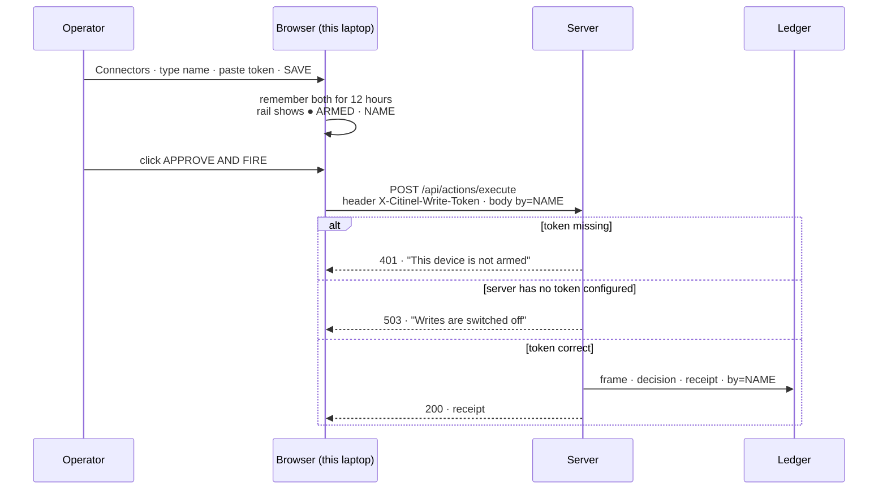
```mermaid
sequenceDiagram
  participant O as Operator
  participant B as Browser (this laptop)
  participant S as Server
  participant L as Ledger
  O->>B: Connectors · type name · paste token · SAVE
  B->>B: remember both for 12 hours<br/>rail shows ● ARMED · NAME
  O->>B: click APPROVE AND FIRE
  B->>S: POST /api/actions/execute<br/>header X-Citinel-Write-Token · body by=NAME
  alt token missing
    S-->>B: 401 · "This device is not armed"
  else server has no token configured
    S-->>B: 503 · "Writes are switched off"
  else token correct
    S->>L: frame · decision · receipt · by=NAME
    S-->>B: 200 · receipt
  end
```

---

## Design system

The aesthetic lane is *statutory instrumentation*: glass-cockpit and trading-terminal discipline, not dashboard decoration. The test for every screen is whether it could be produced in a tribunal unaltered, never whether it looks premium. The console is dark-first and built from one token set under the `--ctn-` namespace; nothing is coloured per screen.

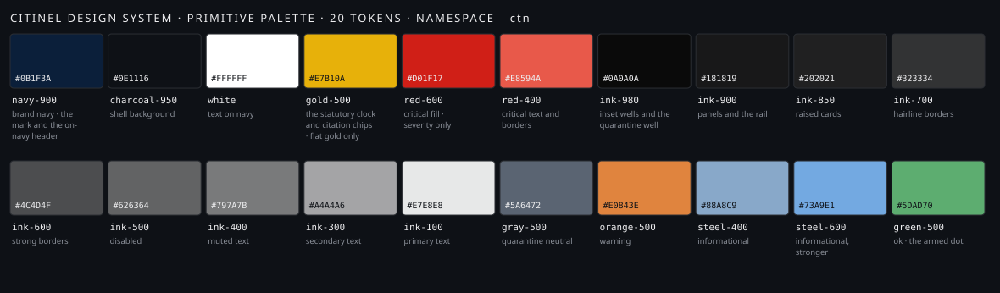

Five hexes are locked: navy `#0B1F3A`, charcoal `#0E1116`, white, evidence-gold `#E7B10A` and severity-red `#D01F17` for fills with `#E8594A` for text on dark. Everything else is derived from those in OKLCH. Gold appears on exactly two element types system-wide, citation chips and the statutory clock. Red is severity only, and the deny dead-end. No component takes both.

| Role | Face | Where |
|---|---|---|
| Display | **Michroma**, fallback Orbitron | placards only: eyebrows, labels, the clock, every all-caps control, at 0.12 to 0.14 em tracking; never a heading tag, never prose |
| Body | **IBM Plex Sans** | prose, notes and table text at 14 px / 1.55, an instrumentation-heritage grotesque with a distinct numeral set |
| Data | system monospace | log lines, hashes, citations, tabular numbers with slashed zero, letter-spacing always zero, because log text must never wait on a font download |

**The rules every screen obeys.**

- **Borrow a real instrument and name it.** A strip board, a radial gauge, a beam balance, a tape transport, a clock face, chain links, a seal press. Never a re-skin of one grid.
- **The single most critical element dominates** by an order of magnitude. It is never a peer among equal boxes.
- **One state-tied physical behaviour per hero screen**, driven by real data: a needle sweep, a strip advance, a ring completing, a press head lowering. Nothing decorative, and nothing that competes with an approve or deny decision.
- **The arc-into-ring device** for Caught, Cited, Gated, Actioned, Closed is the product's one signature move: a navy circle, a gold arc, a dashed hollow circle whose deny branch dead-ends in a red square, a navy diamond, and finally a full gold ring. It recurs only where it is honestly earned.
- **Severity is a ramp of colour, shape, printed label and rank**: a critical octagon, a high triangle, a medium diamond, a low circle, discriminable in greyscale.
- **Evidence has a fixed grammar.** Citation chips are gold hairline pills with a visible locator. Provenance is always the triplet of timestamp, source and hash. The audit log has no edit, delete or reorder affordance. Attacker-controlled text always rides in the four-signal quarantine well: monospace, inset, dashed grey, persistent corner label.
- **No gradients, no glow, no blur, no glassmorphism, no photography, no emoji.** Elevation is stepped surface lightness, never shadow bloom. Exactly three radii.
- **The self-test**, negative and positive at once: could this be mistaken for a generic SaaS dashboard with the labels swapped, and does it have terminal density *with* decisive hierarchy.

The full system, with its token tiers, component contracts and adherence lint, lives in [dashboard/static/_ds](dashboard/static/_ds/citinel-design-system-fdfd662c-b7a8-446c-963a-2f11a1f91d2a/readme.md).

---

## How it answers the judging axes

| What judges look for | CITINEL's answer | Where to look | The honest gap |
|---|---|---|---|
| Problem alignment and functional scope | PS4 names five terms and all five are built: *autonomous* (the per-class dial), *cyber SOC* (sixteen operational screens plus a scripted demo), *AI-powered* (twelve agents across two vendors), *threat detection* (a pinned 3,302-rule Sigma release plus anomaly scoring), *automated response* (a policy gate with rollback tokens) | Queue, then Replay, then Approvals | the demo data is generic, not banking-specific |
| Technical execution and a working prototype | Deployed and public, not a slide deck. Seventeen screens, sixteen connectors all configured, 420 automated tests, eleven external services proven with real calls, and a read-only pre-flight that prints GO or names the fault | the live URL, then Audit | response actions hit simulated endpoints |
| Interface and experience | One design system across every screen. Every screen names its own data source, a live chip shows when data is real, a red banner appears when it is not, and a role toggle switches analyst and CISO depth | Replay scrubbing, then Confidence | three backend features have no console control yet |
| Innovation, market readiness and scale | No competitor drafts CERT-In or DPDP forms; the nearest claimant failed independent verification. The architecture is stateless behind a persistent ledger and already runs on managed infrastructure | Compliance, then the printed Report | impact is unvalidated; no bank has shared its telemetry yet |

---

## Run it yourself

**Prerequisites.** Python 3.11 with a virtual environment (the system Python 3.9 on a Mac cannot import the package), and Node 20 only if you want the Swytchcode leg.

```bash
git clone https://github.com/agdanish/CITINEL && cd CITINEL
cd backend && python3.11 -m venv .venv && .venv/bin/pip install -e ".[swarm,api,detect]" && cd ..
cp .env.example .env            # every variable is documented there; names only, no values are committed
backend/.venv/bin/uvicorn citinel.web.app:app --host 127.0.0.1 --port 8000
```

Open <http://127.0.0.1:8000>. With no keys set, every connector reports `not_configured` honestly and the console still opens on the committed corpus slice.

```bash
cd backend && .venv/bin/python -m pytest -q          # 420 tests
```

```bash
python3 scripts/preflight.py                         # read-only GO / NO-GO against the live console; no token, no credits
```

```bash
backend/.venv/bin/citinel swarm run INC-0417 --incidents-dir <a scratch copy of data/seed>   # a real swarm run; spends Anthropic credits
```

**Deploy.** [deploy/render.yaml](deploy/render.yaml) is a Render blueprint: a web service, a background worker, a cron tamper check, a self-hosted n8n, a database, two persistent disks and a shared environment group. Every secret is declared by name and set in the dashboard, never committed.

**Re-capture the screenshots.** [docs/readme/capture.mjs](docs/readme/capture.mjs) shoots all seventeen screens from the live deployment with Playwright.

---

## What CITINEL does not claim

These are the lines a product built to stop AI from overclaiming has to hold about itself.

- **The false-positive rate is unmeasured.** Industry surveys put it at 46 to 80 percent; CITINEL targets under 10 percent and will publish the measured rate on labelled data. The Eval screen lists it as unmeasured with the reason: no labelled ground-truth corpus exists yet.
- **Sign-offs are drafts.** CITINEL drafts, a named human signs, the bank files. There is no configuration in which the filing is ours.
- **Response actions hit simulated endpoints.** Every one. The Connectors screen reads *EVERY OUTLET IS BLANKED* and *0 of 8 live*.
- **Nothing a model says is evidence.** Only deterministic corroboration with citable indices is. Gemini's and Tavily's readings carry `not_evidence` in the data itself.
- **The Swytchcode Slack leg does not work on the live deployment.** GitHub ticketing does. The ledger records the gap as `not_configured` rather than claiming a message was sent, which is the product's own argument working in public.
- **The demo data is a corpus replay.** Splunk BOTS v1, CC0. No bank has shared its own telemetry yet, so impact on a real cooperative bank is unvalidated.
- **The Sigma rule bodies are not shipped in the container.** The release is pinned, and the 29 rules that fired are listed from the record with their counts.
- **No prize is guaranteed**, and nothing in this file argues otherwise.

---

## Repository map

Only what the application needs to run and what a judge needs to evaluate it is on this branch. Working materials, deck exports and session notes live on the `archive/working-materials` branch, untouched.

```
backend/citinel/        the service: ingest → OCSF → detect → incidents → agents → policy → audit → web
  agents/               the swarm, the quarantine fence, the citation gate, the sweep, vision
  connectors/           Tavily, VirusTotal, AbuseIPDB, Gemini, Lyzr, n8n, Startuped, Swytchcode
  audit/                the hash-chained ledger
  policy/               the gate and the readable rulebook
  compliance/           the CERT-In and DPDP drafters and the guards
  ops/                  the six-hourly ledger watch
  web/app.py            36 routes, the write guard, the console's API
backend/tests/          420 tests
dashboard/static/       the console: 17 screens (*.dc.html), nav.js, api.js, the design system under _ds/
data/seed/              the committed corpus slice (Splunk BOTS v1, CC0), ledger and saved swarm runs
policies/               the rulebook (YAML) and its OPA Rego mirror
connectors/n8n/         the exported n8n playbook
evals/                  the harness, and the labelled set it is waiting for
deploy/                 render.yaml and the two Dockerfiles
scripts/                preflight.py, exercise_production.py, record_demo.py
.swytchcode/            the Swytchcode workspace, policies and integration bundles
docs/                   the evidence trail, below, and docs/readme/ with the screenshots and palette
```

## The evidence trail

Every claim above traces somewhere a judge can open.

| Document | What it holds |
|---|---|
| [CITINEL-PROPOSAL.md](CITINEL-PROPOSAL.md) | the full proposal, every claim tied to a research finding id |
| [CITINEL-SDD.md](CITINEL-SDD.md) | the design document, with the adversarially verified research passes |
| [CITINEL_PS4_AeroFyta_DecodeSIH2026.pdf](CITINEL_PS4_AeroFyta_DecodeSIH2026.pdf) | the Round 1 submission deck |
| [docs/CITINEL-UVP-MASTER-LIST.md](docs/CITINEL-UVP-MASTER-LIST.md) | the forty items, each with its evidence tier, and the list of what must never be claimed |
| [docs/CITINEL-KNOWLEDGE-BASE.md](docs/CITINEL-KNOWLEDGE-BASE.md) | the whole product in short sentences, including the forty items by screen |
| [docs/CITINEL-WALKTHROUGH.md](docs/CITINEL-WALKTHROUGH.md) | every screen in operating order, with its interface strings quoted verbatim |
| [docs/CITINEL-DEMO-DRILL.md](docs/CITINEL-DEMO-DRILL.md) | how to check each of the forty, and what not to fake |
| [docs/CITINEL-FACT-SHEET.pdf](docs/CITINEL-FACT-SHEET.pdf) | the one-page fact sheet |
| Six `*-QUALIFICATION.md` files at the root | one per partner track, criterion by criterion, with honest limits |
| [PARTNER-ONBOARDING.md](PARTNER-ONBOARDING.md), [LYZR-AGENT-CONFIG.md](LYZR-AGENT-CONFIG.md), [STARTUPED-GTM-PLAYBOOK.md](STARTUPED-GTM-PLAYBOOK.md) | the partner checklist, the seven Lyzr agents' instructions, the go-to-market inputs |
| [docs/CITINEL-DDR-03-EXPLAINED.md](docs/CITINEL-DDR-03-EXPLAINED.md) | the security and threat model, explained in plain English, every box and every arrow |
| [docs/A1](docs/A1-market-impact.md) to [A8](docs/A8-maturity-depth-and-ps-alignment.md) | the research corpus: market, competition, technical, judging, analyst UX, compliance, security and IP, maturity |
| [docs/SESSION-2026-09-03-04-FINDINGS.md](docs/SESSION-2026-09-03-04-FINDINGS.md) | the audit that ran every seam for real: eighteen bugs, every one with a commit |
| [docs/exercising-a-deployment.md](docs/exercising-a-deployment.md) | how to exercise a deployment end to end |

## Team

**Team AeroFyta**, Chennai Institute of Technology. Decode SIH 2026, track *Bharat Pragati*, problem statement PS4: *Autonomous Cyber SOC for AI-powered threat detection and automated incident response*. Finalist.

We chose cooperative banks rather than the obvious enterprise buyer because they carry a national bank's legal duties on a two-person IT team's budget, and because nobody was building for them. Everything in this file follows from taking that seriously: a product that shows its work, so a regulator can trust it, and that says what it has not done, so a bank can.

*Data: Splunk BOTS v1 telemetry replay (CC0). Response endpoints: simulated. Reports: drafted by CITINEL, signed by a human, filed by the bank.*
